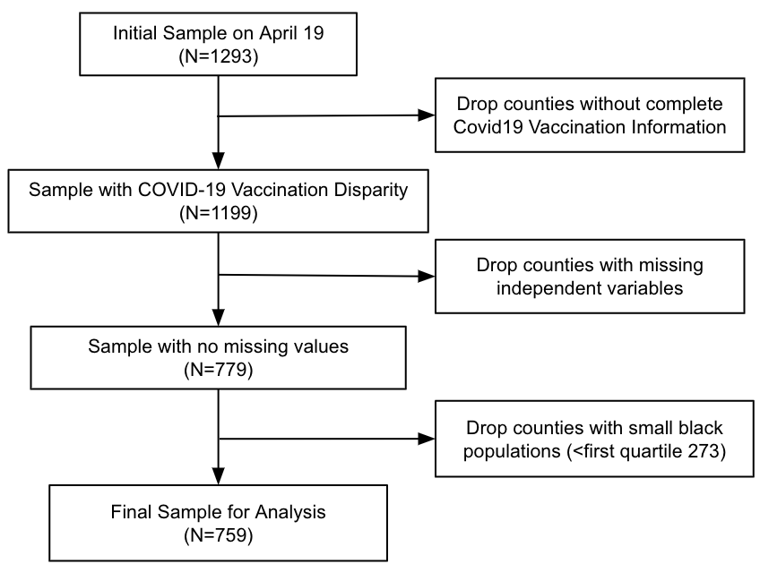
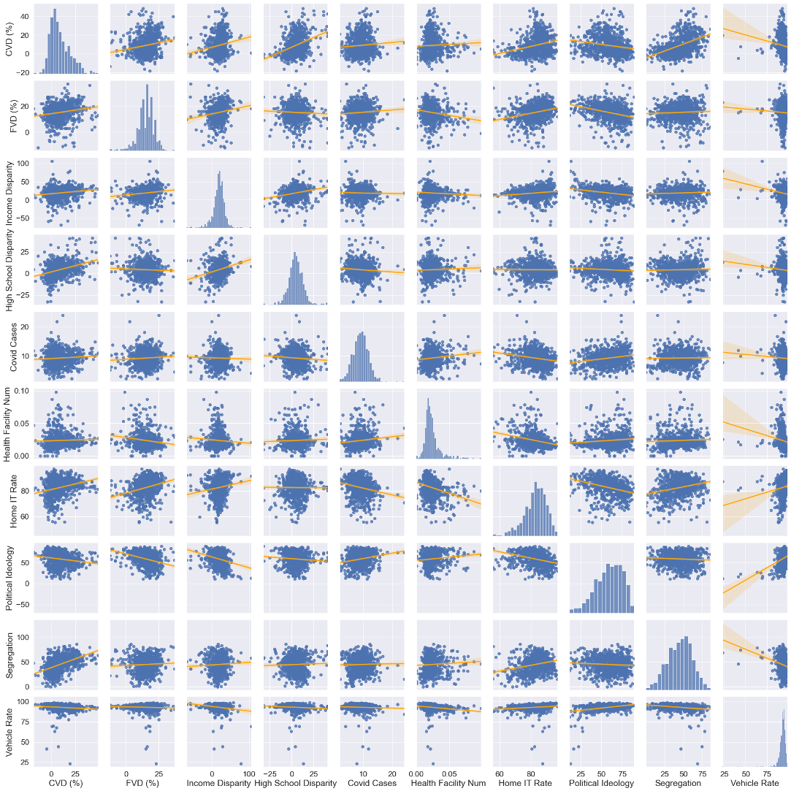

# Socioeconomic Privilege and Political Ideology are Associated with Racial Disparity in COVID-19 Vaccination: Methods and Materials

This public repository contains the materials for reproducing the methods described in Agarwal et al. (2021) _Socioeconomic Privilege and Political Ideology Are Associated with Racial Disparity in COVID-19 Vaccination_ and additional supplementary analyses. 

Materials for reproducibility include:

1. [COVID-19 vaccination rate data](https://github.com/CHIDS-UMD/Covid19-Vaccination-Race-Disparity/tree/main/CountyVaccine) and Python code to reproduce the data collection, including: 
    a) Explain purpose of first Python notebook and link to it ("Autonomy")  
    b) Explain purpose of second Python notebook and link to it ("Manual")  
    c) Explain purpose of third Python notebook and link to it ("Per County")  
    d) Explain purpose of fourth Python notebook and link to it ("Tableau")  
    
2. [Data](https://github.com/mdugasumd/Covid19-Vaccination-Race-Disparity/tree/main/DataMerge) and [Python code](https://github.com/mdugasumd/Covid19-Vaccination-Race-Disparity/blob/main/2.DataMerge.ipynb) to merge information from the various sources cited in our Supplementary Information (SI) Appendix.

3. Python code for [cleaning the data](https://github.com/CHIDS-UMD/Covid19-Vaccination-Race-Disparity/blob/main/2.DataClean.ipynb). 

4. [Code](https://github.com/CHIDS-UMD/Covid19-Vaccination-Race-Disparity/blob/main/3.StataCode.ipynb) to reproduce our main regression analyses (reported in main text) and robustness checks (reported in SI Appendix) as well as  additional supplementary analyses reported here. 

Below, we also provide additional summary statistics, exploratory data analysis, and full results for the robustness checks described in the SI appendix. 

## Sources for COVID-19 Vaccination Data by Race

| State          | # of Counties | # of Valid Counties | Data Source                                                                                                                                                       |
|----------------|---------------|---------------------|---------------------------------------------------------------------------------------------------------------------------------------------------------------|
| California     | 54            | 43                  | https://covid19.ca.gov/vaccines/#California-vaccines-dashboard                                                                                                |
| Illinois       | 102           | 42                  | https://www.dph.illinois.gov/covid19/vaccinedata?county=Illinois                                                                                              |
| Indiana        | 89            | 37                  | https://www.coronavirus.in.gov/vaccine/2680.htm                                                                                                               |
| Maine          | 16            | 8                   | https://www.maine.gov/covid19/vaccines/dashboard                                                                                                              |
| New Jersey     | 21            | 21                  | https://www.nj.gov/health/cd/topics/covid2019_dashboard.shtml                                                                                                 |
| New York       | 62            | 48                  | https://covid19vaccine.health.ny.gov/covid-19-vaccine-tracker                                                                                                 |
| North Carolina | 43            | 43                  | https://covid19.ncdhhs.gov/dashboard/data-behind-dashboards                                                                                                   |
| Ohio           | 88            | 57                  | https://coronavirus.ohio.gov/wps/portal/gov/covid-19/dashboards/covid-19-vaccine/covid-19-vaccination-dashboard                                               |
| Oregon         | 23            | 11                  | https://public.tableau.com/profile/oregon.health.authority.covid.19#!/vizhome/OregonCOVID-19VaccinationTrends/OregonCountyVaccinationTrends                   |
| Pennsylvania   | 60            | 40                  | https://www.health.pa.gov/topics/disease/coronavirus/Vaccine/Pages/Vaccine.aspx                                                                               |
| South Carolina | 46            | 43                  | https://scdhec.gov/covid19/covid-19-vaccination-dashboard                                                                                                     |
| Tennessee      | 90            | 62                  | https://www.tn.gov/health/cedep/ncov/data/downloadable-datasets.html                                                                                          |
| Texas          | 245           | 139                 | https://tabexternal.dshs.texas.gov/t/THD/views/COVID-19VaccineinTexasDashboard/Summary?%3Aorigin=card_share_link&%3Aembed=y&%3AisGuestRedirectFromVizportal=y |
| Virginia       | 133           | 111                 | https://www.vdh.virginia.gov/coronavirus/covid-19-vaccine-demographics/                                                                                       |
| West Virginia  | 55            | 23                  | https://dhhr.wv.gov/COVID-19/Pages/default.aspx                                                                                                               |
| Wisconsin      | 72            | 28                  | https://www.dhs.wisconsin.gov/covid-19/vaccine-data.htm#day                                                                                                   |
| Sum            | 1199          | 759                 |                                                                                                                                                               |

_Note_. Valid counties are those that were included in our main regression analyses, following the exclusion criteria outlined below in our sample construction figure. 

## Missingness in Predictor Variable Data

**Note to add figure depicting missingness**

## Sample Construction

The filtering of the data collected for all counties on April 19.

**Note, please change capitalization of black to Black, and also change independent variables to predictor variables**

## Summary Statistics

We present descriptive statistics of the variables in our regression analysis. 	

**Note maybe add new column called 'data field' that maps how we refer to the variables in our paper to the names of the variables in the data files**

| Variable                      | Description                                                                                                                                                                                                           | Source                                                                                                                                                                                                                                            | count | mean   | std    | min     | 25%    | 50%    | 75%    | max     |
|-------------------------------|-----------------------------------------------------------------------------------------------------------------------------------------------------------------------------------------------------------------------|---------------------------------------------------------------------------------------------------------------------------------------------------------------------------------------------------------------------------------------------------|-------|--------|--------|---------|--------|--------|--------|---------|
| CVD                           | Covid vaccination disparity between White and Black populations in county i.                                                                                                                                               | Department of Health in each state                                                                                                                                                                                                                | 759   | 9.021  | 10.435 | -18.168 | 1.502  | 6.756  | 15.192 | 48.640  |
| FVD                           | Flu vaccination disparity between White and Black populations in county i.                                                                                                                                                 | CMS Mapping Medical Disparity Tool (https://data.cms.gov/mapping-medicare-disparities)                                                                                                                                                            | 759   | 15.211 | 6.449  | -12.000 | 12.000 | 16.000 | 19.000 | 37.000  |
| Median Income                 | Household median income in county i.                                                                                                                                                                                  | 2019 ACS 5-Year Estimates Subject Tables                                                                                                                                                                                                          | 759   | 58.412 | 16.584 | 27.063  | 47.796 | 54.489 | 64.032 | 142.299 |
| Median Income Disparity       | Household median income disparity between White and Black populations in county i.                                                                                                                                         | 2019 ACS 5-Year Estimates Subject Tables                                                                                                                                                                                                          | 759   | 19.217 | 15.671 | -67.671 | 12.325 | 20.119 | 28.221 | 106.200 |
| High School Graduation Rate   | Rate of high school or above education attainment in county i.                                                                                                                                                        | 2019 ACS 5-Year Estimates Subject Tables                                                                                                                                                                                                          | 759   | 60.159 | 5.403  | 33.605  | 57.727 | 60.988 | 63.597 | 73.273  |
| High School Disparity         | High school or above education attainment disparity between White and Black populations in county i.                                                                                                                       | 2019 ACS 5-Year Estimates Subject Tables                                                                                                                                                                                                          | 759   | 4.470  | 8.789  | -32.600 | -0.500 | 4.200  | 9.000  | 41.000  |
| Health Facilities Per Capita  | Number of potential health facilities which provide COVID-19 vaccine per person in county i.                                                                                                                          | VaxMap 2.0 (https://www.westhealth.org/resource/vaxmap-potential-covid-19-vaccine-locations/)                                                                                                                                                     | 759   | 0.024  | 0.012  | 0.000   | 0.017  | 0.021  | 0.026  | 0.098   |
| COVID-19 Cases Per Capita     | Number of COVID-19 cases per person in county i by April 19th, 2021 | The Center for Systems Science and Engineering (CSSE) at Johns Hopkins University (https://github.com/CSSEGISandData/COVID-19)                                                                                                                    | 759   | 9.260  | 2.650  | 2.092   | 7.486  | 9.286  | 10.924 | 24.131  |
| Home IT Rate                  | Rate of computer ownership and internet in the home in county i.                                                                                                                                                                  | 2019 ACS 5-Year Estimates Subject Tables                                                                                                                                                                                                          | 759   | 82.652 | 7.070  | 55.600  | 78.700 | 83.400 | 87.600 | 97.000  |
| Home IT Disparity             | Computer ownership and internet in the home disparity between White and Black populations in county i.                                                                                                                                 | 2019 ACS 5-Year Estimates Subject Tables                                                                                                                                                                                                          | 759   | 7.543  | 10.496 | -21.700 | 1.250  | 7.100  | 13.050 | 73.700  |
| Urban                         | Dummy variable that equals 1 if county i is located in an urban area.                                                                                                                                                | CMS Mapping Medical Disparity Tool (https://data.cms.gov/mapping-medicare-disparities)                                                                                                                                                            | 759   | 0.605  | 0.489  | 0.000   | 0.000  | 1.000  | 1.000  | 1.000   |
| Rate of Vehicle Ownership     | Rate of households with vehicles in county i.                                                                                                                                                                         | CDC Social Vulnerability Index (https://www.atsdr.cdc.gov/placeandhealth/svi/index.html)                                                                                                                                                          | 759   | 92.914 | 4.952  | 23.000  | 91.800 | 93.700 | 95.200 | 98.600  |
| Political Ideology            | Rate of people who voted Republican in 2020 presidential election in county i.                                                                                                                                                     | USA Today (https://www.usatoday.com/in-depth/graphics/2020/11/10/election-maps-2020-america-county-results-more-voters/6226197002/)                                                                                                               | 759   | 58.688 | 16.066 | 11.249  | 47.915 | 60.317 | 71.514 | 89.324  |
| Segregation Index             | The degree to which Black and White groups live separately from one another in county i.                                                                                                                              | 2021 County Health Rankings (https://www.countyhealthrankings.org/explore-health-rankings/measures-data-sources/county-health-rankings-model/health-factors/social-and-economic-factors/family-social-support/residential-segregation-blackwhite) | 759   | 44.941 | 16.163 | 0.041   | 33.305 | 45.875 | 56.490 | 86.159  |
| Racial Bias                   | Weighted implicit racial bias in county i.                                                                                                                                                                            | Data from Riddle and Sinclair (2019; https://osf.io/pu79a/)                                                                   | 759   | 39.989 | 1.877  | 31.156  | 39.192 | 40.176 | 40.884 | 44.453  |
| Vaccine Hesitancy             | COVID-19 vaccine hesitancy in county i.                                                                                                                                                                               | Department of Health and Human Services, Office of the Assistant Secretary for Planning and Evaluation (https://aspe.hhs.gov/pdf-report/vaccine-hesitancy)                                                                                        | 759   | 17.673 | 3.792  | 7.000   | 15.000 | 18.000 | 19.500 | 27.000  |
| Proportion of Black Residents | Proportion of black residents in county i.                                                                                                                                                                            | County Population by Characteristics: 2010-2019 (https://www.census.gov/data/tables/time-series/demo/popest/2010s-counties-detail.html)                                                                                                           | 759   | 12.367 | 13.124 | 0.541   | 3.042  | 7.429  | 16.784 | 76.973  |
| Flu Vaccination Rate          | Rate of flu vaccination among Medicare beneficiaries in county i.                                                                                                                                                                                  | CMS Mapping Medical Disparity Tool (https://data.cms.gov/mapping-medicare-disparities)                                                                                                                                                            | 759   | 47.610 | 7.549  | 19.000  | 43.000 | 49.000 | 53.000 | 65.000  |
| Flu Vaccination Disparity             | Flu vaccination disparity between White and Black Medicare beneficiaries in county i.                                                                                                                                                 | CMS Mapping Medical Disparity Tool (https://data.cms.gov/mapping-medicare-disparities)                                                                                                                                                            | 759   | 15.211 | 6.449  | -12.000 | 12.000 | 16.000 | 19.000 | 37.000  |
| Proportion of Pop. Above Age 75                  | Rate of elderly population (>=75) in county i.                                                                                                                                                                        | County Population by Characteristics: 2010-2019 (https://www.census.gov/data/tables/time-series/demo/popest/2010s-counties-detail.html)                                                                                                              | 759   | 7.671  | 1.848  | 3.515   | 6.457  | 7.683  | 8.753  | 17.853  |
| Above Age 75 Disparity            | Elderly population (>=75) disparity between white and black people in county i.                                                                                                                                       | County Population by Characteristics: 2010-2019 (https://www.census.gov/data/tables/time-series/demo/popest/2010s-counties-detail.html)                                                                                                              | 759   | 3.638  | 2.310  | -4.910  | 2.215  | 3.515  | 5.074  | 12.933  |

### Scatter Matrix

**Note to update scatter matrix to be comprehensive (e.g., missing median income, some covariates)**

## Detailed Regression Results and Robustness Checks

### Regression Results

OLS regression results for robustness checks (Models 1, 2, 5, and 6) are presented below along with results from the main text (Models 3 and 4) with all continuous variables standardized for ease of interpretation. 

|                                 | (1)            | (2)            | (3)            | (4)       | (5)            | (6)            |
|---------------------------------|----------------|----------------|----------------|-----------|----------------|----------------|
| VARIABLES                       | CVD (March 27) | CVD (April 07) | CVD (April 19) | FVD       | CVD (April 19) | CVD (April 19) |
|                                 |                |                |                |           |                |                |
| **Economic Stability**            |                |                |                |           |                |                |
| Median Income                   | -1.937*       | -2.320*       | -2.434*       | 1.145    | -3.217**      | -2.240*       |
|                                 | (0.866)        | (0.995)        | (1.084)        | (0.589)   | (1.054)        | (0.929)        |
| Median Income Disparity         | 0.703*        | 0.776         | 0.984         | 0.843*   | 0.625          | 1.109*        |
|                                 | (0.287)        | (0.394)        | (0.489)        | (0.312)   | (0.486)        | (0.497)        |
|**Education Access and Quality**                                |                |                |                |           |                |                |
| High School Graduation Rate     | 2.177**       | 2.639**       | 2.790**       | -0.243    | 2.891**       | 3.024**       |
|                                 | (0.510)        | (0.637)        | (0.729)        | (0.336)   | (0.638)        | (0.481)        |
| High School Disparity           | 2.043**       | 2.562**       | 2.993**       | -0.116    | 2.861**       | 1.981**       |
|                                 | (0.420)        | (0.435)        | (0.474)        | (0.469)   | (0.458)        | (0.515)        |
|**Healthcare Access and Quality**                                 |                |                |                |           |                |                |
| Health Facilities Per Capita    | 1.012         | 1.147          | 1.451         | -0.282    | 1.354*        | 1.304*        |
|                                 | (0.498)        | (0.655)        | (0.760)        | (0.350)   | (0.621)        | (0.581)        |
| COVID-19 Cases Per Capita       | 0.379          | 0.488          | 0.318          | 0.219     | 0.496          | 0.632*        |
|                                 | (0.405)        | (0.444)        | (0.488)        | (0.330)   | (0.310)        | (0.240)        |
|**Neighborhood and Built Environment**                                 |                |                |                |           |                |                |
| Home IT Rate                    | 1.148**       | 1.266*        | 1.576**       | 0.113     | 1.610*        | 0.705          |
|                                 | (0.370)        | (0.441)        | (0.472)        | (0.382)   | (0.558)        | (0.584)        |
| Home IT Disparity               | -0.00401       | 0.118          | 0.216          | 0.0783    | 0.0242         | 0.633          |
|                                 | (0.539)        | (0.609)        | (0.756)        | (0.380)   | (0.700)        | (0.684)        |
| Urban                           | -0.591         | -0.285         | 0.168          | 0.182     | -0.280         | -0.445         |
|                                 | (0.482)        | (0.625)        | (0.789)        | (0.651)   | (0.730)        | (0.598)        |
| Vehicle Ownership Rate          | 2.358*        | 2.962**       | 3.012*        | -0.119    | 2.551*        | 1.443          |
|                                 | (0.836)        | (0.967)        | (1.227)        | (0.654)   | (1.101)        | (1.084)        |
|**Social and Community Context**                                 |                |                |                |           |                |                |
| Political Ideology              | -2.053**      | -2.601**      | -3.095**      | -1.764** | -2.678**      | -2.216**      |
|                                 | (0.597)        | (0.658)        | (0.722)        | (0.410)   | (0.538)        | (0.478)        |
| Segregation                     | 0.264          | 0.531          | 0.599          | 0.813***  | 0.370          | 0.521          |
|                                 | (0.511)        | (0.594)        | (0.715)        | (0.257)   | (0.682)        | (0.751)        |
| Racial Bias                     | 1.169*        | 1.145         | 1.144          | 0.331     | 0.980         | 0.429          |
|                                 | (0.509)        | (0.606)        | (0.705)        | (0.390)   | (0.524)        | (0.401)        |
|**Covariates**                                 |                |                |                |           |                |                |
| Vaccine Hesitancy               | 1.231          | 1.290          | 1.335          | -0.388    | 1.754          | 0.790          |
|                                 | (1.380)        | (1.630)        | (1.776)        | (0.679)   | (1.599)        | (1.358)        |
| Proportion of Black Pop.        | -1.672         | -1.798         | -2.072         | 0.0393    | -1.820         | -1.338         |
|                                 | (1.043)        | (1.226)        | (1.290)        | (0.551)   | (1.092)        | (0.909)        |
| Flu Vaccination Rate            |                |                |                |           | 1.686*        | 0.839          |
|                                 |                |                |                |           | (0.621)        | (0.513)        |
| Flu Vaccination Disparity       |                |                |                |           | 1.351**       | 0.944         |
|                                 |                |                |                |           | (0.443)        | (0.485)        |
| Proportion of Pop. Above Age 75 |                |                |                |           |                | -1.751*       |
|                                 |                |                |                |           |                | (0.674)        |
| Above Age 75 Disparity          |                |                |                |           |                | 3.281**       |
|                                 |                |                |                |           |                | (0.493)        |
| Constant                        | 7.764**       | 7.475**       | 8.025**       | 12.95**  | 9.218**       | 9.849**       |
|                                 | (1.685)        | (1.022)        | (1.125)        | (0.803)   | (0.957)        | (0.912)        |
|                                 |                |                |                |           |                |                |
| Observations                    | 759            | 759            | 759            | 759       | 759            | 759            |
| Covered Population (million)    | 171.99         | 171.99         | 171.99         | 171.99    | 171.99         | 171.99         |
| Covered Population (percentage) | 0.524          | 0.524          | 0.524          | 0.524     | 0.524          | 0.524          |
| R-squared                       | 0.813          | 0.818          | 0.823          | 0.453     | 0.839          | 0.863          |
| State Dummies                   | True           | True           | True           | True      | True           | True           |
| Robust Standard Error           | True           | True           | True           | True      | True           | True           |
| Clustered at State Level        | True           | True           | True           | True      | True           | True           |
| Weighted with County Population | True           | True           | True           | True      | True           | True           |
