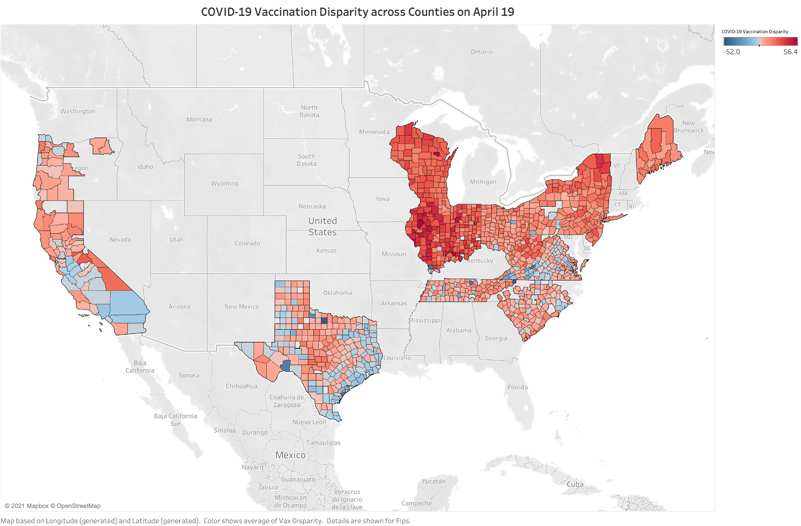
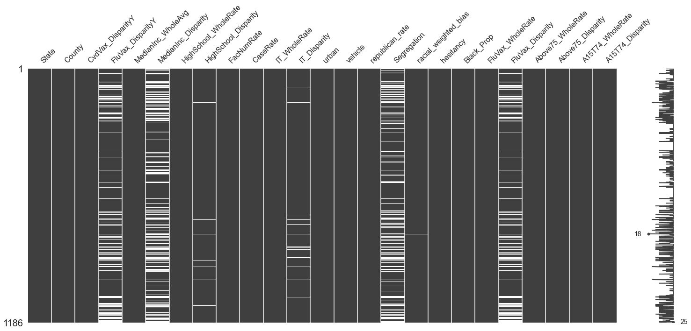
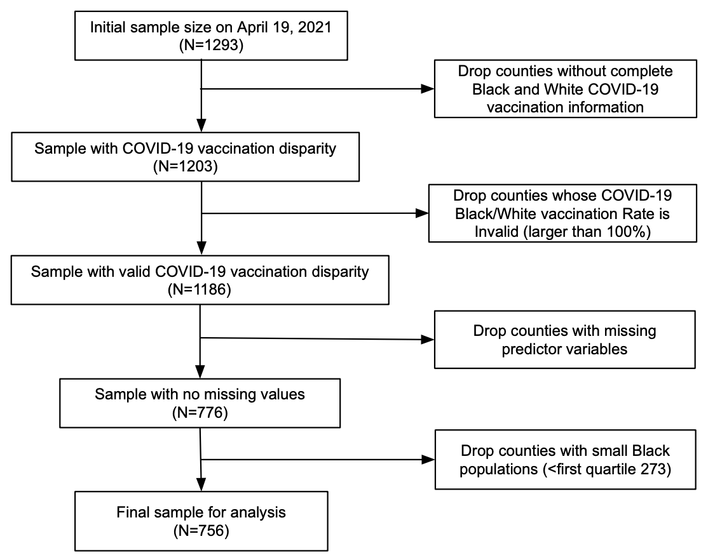
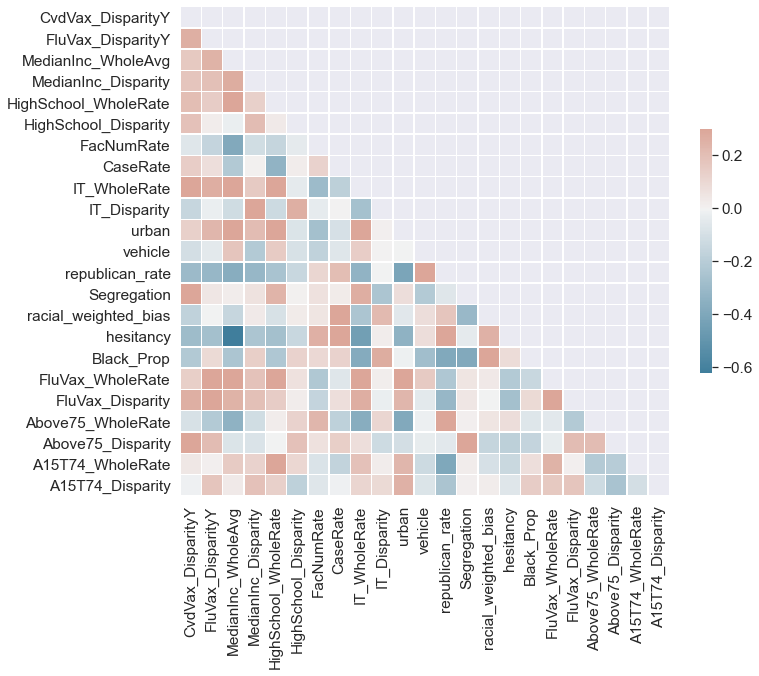

# Socioeconomic Privilege and Political Ideology are Associated with Racial Disparity in COVID-19 Vaccination: Methods and Materials

This public repository contains the materials for reproducing the results described in Agarwal et al. (2021) _Socioeconomic Privilege and Political Ideology Are Associated with Racial Disparity in COVID-19 Vaccination_ and additional supplementary analyses. 

## Table of Contents

- [Content Description](#materials)

- [Data Sources for COVID-19 Racial Vaccination by States](#covid-race-data-by-state)

    * [COVID-19 Vaccination Disparity Map](#covid-map)
    
    * [Hispanic White Porportion for Each State](#hispanic-white-rate)

- [Missingness](#missing)

- [Summary Statistics for Final Data](#summary-statistics)

    * [Correlation Matrix Heatmap for Final Data](#correlation-map)
    

- [Main Regression Result](#main-reg)

    * [Base Model Regression Table](#base-model)

 
- [Robustness Checks](#robustness-checks)

    * [Age Group Controls](#age-control)
    
    * [Different Disparity Operationalizations](#disparity-measure)
    
    * [Different Dates and Full Vaccination Rate](#date-ratetype)
    
    * [Residential Mobility](#exodus-test)
    
    * [Recent Positive Rate per COVID-19 Test](#positivity)
    
    * [Avoid Collinearity by Droping `Hesitancy` Variable](#drop-hesitancy)

    * [Subsample Analysis (6 States and 10 States)](#610states)
   
   * [Vaccination Rate on Whole White Population](#rate-on-white)

  

   

<a name="materials"/>

## Content Description
Materials for reproducibility include:

1. [COVID-19 vaccination rate data](https://github.com/CHIDS-UMD/Covid19-Vaccination-Race-Disparity/tree/main/CountyVaccine) and Python code to reproduce the data collection, including: 

    a) The notebook [1.CountyVaccine_Automation](https://github.com/CHIDS-UMD/Covid19-Vaccination-Race-Disparity/blob/main/1.CountyVaccine_Automation.ipynb) includes the code to collect the county-level vaccination information by race from the States whose vaccination data is oragnized in a downlable table. In this notebook, the Python code can automatically scrape the data. The States include： Illinois, Texas, Pennsylvania, Indiana, and Virginia.  
    
    b) The notebook [1.CountyVaccine_Tableau](https://github.com/CHIDS-UMD/Covid19-Vaccination-Race-Disparity/blob/main/1.CountyVaccine_Tableau.ipynb) is designed to collect the county-level vaccination information by race from the States whose vaccination information is present in a Tableau Dashboard format. In this notebook, the Python code can also automatically scrape the data. The States include：New York, Wisconsin, Ohio, South Carolina, and Oregon. 
    
    c) The notebook [1.CountyVaccine_Manual](https://github.com/CHIDS-UMD/Covid19-Vaccination-Race-Disparity/blob/main/1.CountyVaccine_Manual.ipynb) is developed to collect the county-level racial vaccination information from the States whose vaccination information needs to be collected manually before running the code. These States include: California, Tennessee, North Carolina, West Virginia, Maine, and New Jersey. The instructions on manual collections are documented [here](https://github.com/CHIDS-UMD/Covid19-Vaccination-Race-Disparity/tree/main/CountyVaccine/Documents/Part1).  
    
2. [Data](https://github.com/CHIDS-UMD/Covid19-Vaccination-Race-Disparity/tree/main/DataMerge) and [Python code](https://github.com/CHIDS-UMD/Covid19-Vaccination-Race-Disparity/blob/main/2.DataMerge.ipynb) to merge information from the various sources cited in our Supplementary Information (SI) Appendix.

3. Python code for [cleaning the data](https://github.com/CHIDS-UMD/Covid19-Vaccination-Race-Disparity/blob/main/2.DataClean.ipynb). 

4. [Clean data](https://github.com/CHIDS-UMD/Covid19-Vaccination-Race-Disparity/tree/main/StataReg) and [code](https://github.com/CHIDS-UMD/Covid19-Vaccination-Race-Disparity/blob/main/3.StataCode.ipynb) to reproduce our main regression analyses (reported in main text) and robustness checks (reported in SI Appendix) as well as  additional supplementary analyses reported here. 

Below, we also provide additional summary statistics, exploratory data analysis, and full results for the robustness checks described in the SI appendix. 

<a name="covid-race-data-by-state"/>

## Data Sources for COVID-19 Racial Vaccination by States

| State          | # of Counties | Population (million) | # of Valid Counties | Population in Analysis (million) | Data Source                                                                                                                                                   |
|----------------|---------------|----------------------|---------------------|----------------------------------|---------------------------------------------------------------------------------------------------------------------------------------------------------------|
| California     | 54            | 39.45                | 43                  | 39.09                            | https://covid19.ca.gov/vaccines/#California-vaccines-dashboard                                                                                                |
| Illinois       | 100           | 12.46                | 41                  | 11.41                            | https://www.dph.illinois.gov/covid19/vaccinedata?county=Illinois                                                                                              |
| Indiana        | 88            | 6.62                 | 37                  | 5.31                             | https://www.coronavirus.in.gov/vaccine/2680.htm                                                                                                               |
| Maine          | 16            | 1.34                 | 8                   | 1.01                             | https://www.maine.gov/covid19/vaccines/dashboard                                                                                                              |
| New Jersey     | 21            | 8.88                 | 21                  | 8.88                             | https://www.nj.gov/health/cd/topics/covid2019_dashboard.shtml                                                                                                 |
| New York       | 62            | 19.45                | 48                  | 18.79                            | https://covid19vaccine.health.ny.gov/covid-19-vaccine-tracker                                                                                                 |
| North Carolina | 43            | 8.56                 | 43                  | 8.56                             | https://covid19.ncdhhs.gov/dashboard/data-behind-dashboards                                                                                                   |
| Ohio           | 88            | 11.69                | 57                  | 10.57                            | https://coronavirus.ohio.gov/wps/portal/gov/covid-19/dashboards/covid-19-vaccine/covid-19-vaccination-dashboard                                               |
| Oregon         | 23            | 4.05                 | 11                  | 3.22                             | https://public.tableau.com/profile/oregon.health.authority.covid.19#!/vizhome/OregonCOVID-19VaccinationTrends/OregonCountyVaccinationTrends                   |
| Pennsylvania   | 60            | 12.68                | 40                  | 11.66                            | https://www.health.pa.gov/topics/disease/coronavirus/Vaccine/Pages/Vaccine.aspx                                                                               |
| South Carolina | 46            | 5.15                 | 46                  | 5.15                             | https://scdhec.gov/covid19/covid-19-vaccination-dashboard                                                                                                     |
| Tennessee      | 90            | 6.77                 | 62                  | 6.11                             | https://www.tn.gov/health/cedep/ncov/data/downloadable-datasets.html                                                                                          |
| Texas          | 236           | 27.66                | 137                 | 26.71                            | https://tabexternal.dshs.texas.gov/t/THD/views/COVID-19VaccineinTexasDashboard/Summary?%3Aorigin=card_share_link&%3Aembed=y&%3AisGuestRedirectFromVizportal=y |
| Virginia       | 132           | 8.53                 | 111                 | 8.21                             | https://www.vdh.virginia.gov/coronavirus/covid-19-vaccine-demographics/                                                                                       |
| West Virginia  | 55            | 1.79                 | 23                  | 1.27                             | https://dhhr.wv.gov/COVID-19/Pages/default.aspx                                                                                                               |
| Wisconsin      | 72            | 5.82                 | 28                  | 4.69                             | https://www.dhs.wisconsin.gov/covid-19/vaccine-data.htm#day                                                                                                   |
| Sum            | 1186          | 180.92               | 756                 | 170.65                           |                                                                                                                                                               |

_Note_. Valid counties are those that were included in our main regression analyses, following the exclusion criteria outlined below in the sample construction figure. 

<a name="hispanic-white-rate"/>

## Hispanic White Porportion for Each State

|                                            | 756 counties in the main analysis |                |                     | 744 counties excluding the high mobility counties |                |                     |
| ------------------------------------------ | --------------------------------- | -------------- | ------------------- | ------------------------------------------------- | -------------- | ------------------- |
| State                                      | Total White                       | Hispanic White | Hispanic White Rate | Total White                                       | Hispanic White | Hispanic White Rate |
| States Reporting Non-Hispanic White Vaccination Rate |                                   |                |                     |                                                   |                |                     |
| California                                 | 28368445                          | 13994237       | 0.4933              | 18971980                                          | 8669768        | 0.4570              |
| Illinois                                   | 9551335                           | 2019602        | 0.2114              | 9551335                                           | 2019602        | 0.2114              |
| New Jersey                                 | 6388804                           | 1537809        | 0.2407              | 5953609                                           | 1297376        | 0.2179              |
| Oregon                                     | 3506031                           | 466847         | 0.1332              | 3506031                                           | 466847         | 0.1332              |
| Texas                                      | 21507737                          | 9654049        | 0.4489              | 21031458                                          | 9520356        | 0.4527              |
| Virginia                                   | 5917616                           | 694680         | 0.1174              | 5905834                                           | 688349         | 0.1166              |
|                                            |                                   |                |                     |                                                   |                |                     |
| States Reporting Whole White Vaccination Rate        |                                   |                |                     |                                                   |                |                     |
| Indiana                                    | 5602889                           | 429126         | 0.0766              | 5602889                                           | 429126         | 0.0766              |
| Maine                                      | 1269326                           | 19729          | 0.0155              | 1269326                                           | 19729          | 0.0155              |
| New York                                   | 13546776                          | 2791356        | 0.2061              | 9153734                                           | 1080290        | 0.1180              |
| North Carolina                             | 5918976                           | 741346         | 0.1252              | 5918976                                           | 741346         | 0.1252              |
| Ohio                                       | 9552736                           | 383644         | 0.0402              | 9552736                                           | 383644         | 0.0402              |
| Pennsylvania                               | 10329505                          | 752025         | 0.0728              | 10329505                                          | 752025         | 0.0728              |
| South Carolina                             | 3532048                           | 254506         | 0.0721              | 3132671                                           | 210947         | 0.0673              |
| Tennessee                                  | 5297436                           | 333856         | 0.0630              | 5297436                                           | 333856         | 0.0630              |
| West Virginia                              | 1675122                           | 26610          | 0.0159              | 1675122                                           | 26610          | 0.0159              |
| Wisconsin                                  | 5067781                           | 358716         | 0.0708              | 5067781                                           | 358716         | 0.0708              |

<a name="covid-map"/>

### COVID-19 Vaccination Disparity Map

**Figure S1.** Map represents COVID-19 vaccination disparities across 1,186 counties with data by race as of April 19, 2021. Red indicates higher vaccination rates among Whites, and blue indicates higher vaccination rates among Blacks. The vaccination rate in some counties with small numbers of Blacks or Whites exceeded 100%. We exclude those counties in Figure 1. In the regression using data from 756 counties, the range of vaccination disparity is between -52.0% and 66.2%. 

<a name="missing"/>

## Missingness

**Figure S2.** Patterns of missingness in predictor and outcome variables where white lines indicate values are missing.

<a name="sample-construction"/>

## Sample Construction

The filtering of the data collected for all counties on April 19, 2021. The same method is also applied to the data on March 27 2021, April 07 2021, May 20 2021.

**Figure S3.** Flowchart depicting sample construction.

<a name="summary-statistics"/>

## Summary Statistics for Final Data

We present descriptive statistics of the variables in our regression analysis in non-standardized units. The table below presents rate and proportion data as percentages for ease of interpretation.  	

| Variable                                 | Description                                                                                            | Source                                                                                                                                                                                                                                            | Data Field             | count | mean   | std    | min     | 0.250  | 0.500  | 0.750  | max     |
|------------------------------------------|--------------------------------------------------------------------------------------------------------|---------------------------------------------------------------------------------------------------------------------------------------------------------------------------------------------------------------------------------------------------|------------------------|-------|--------|--------|---------|--------|--------|--------|---------|
| CVD                                      | Covid vaccination disparity between White and Black populations in county i.                           | Department of Health in each state                                                                                                                                                                                                                | Vax_DisparityY         | 756   | 12.119 | 10.355 | -18.168 | 4.922  | 10.451 | 17.757 | 53.842  |
| FVD                                      | Flu vaccination disparity between White and Black populations in county i.                             | CMS Mapping Medical Disparity Tool (https://data.cms.gov/mapping-medicare-disparities)                                                                                                                                                            | FluVax_DisparityY      | 756   | 15.185 | 6.445  | -12.000 | 12.000 | 16.000 | 19.000 | 37.000  |
| Median Income                            | Household median income (in thousands) in county i.                                                    | 2019 ACS 5-Year Estimates Subject Tables                                                                                                                                                                                                          | MedianIncome           | 756   | 58.448 | 16.597 | 27.063  | 48.006 | 54.517 | 64.081 | 142.299 |
| Median Income Disparity                  | Household median income disparity (in thousands) between White and Black populations in county i.      | 2019 ACS 5-Year Estimates Subject Tables                                                                                                                                                                                                          | MedianIncome_Disparity | 756   | 21.003 | 16.109 | -67.705 | 13.660 | 21.828 | 29.514 | 112.332 |
| High School Graduation Rate              | Rate of high school or above education attainment in county i.                                         | 2019 ACS 5-Year Estimates Subject Tables                                                                                                                                                                                                          | HighSchool_Rate        | 756   | 86.931 | 5.305  | 61.800  | 83.975 | 87.900 | 90.900 | 96.800  |
| High School Disparity                    | High school or above education attainment disparity between White and Black populations in county i.   | 2019 ACS 5-Year Estimates Subject Tables                                                                                                                                                                                                          | HighSchool_Disparity   | 756   | 6.762  | 7.881  | -30.300 | 2.400  | 6.200  | 10.700 | 42.200  |
| Health Facilities Per Capita             | Number of potential health facilities which provide COVID-19 vaccine per person in county i.           | VaxMap 2.0 (https://www.westhealth.org/resource/vaxmap-potential-covid-19-vaccine-locations/)                                                                                                                                                     | FacNumRate             | 756   | 0.024  | 0.012  | 0.000   | 0.017  | 0.021  | 0.026  | 0.098   |
| COVID-19 Cases Per Capita                | Number of COVID-19 cases per person in county i by April 19th, 2021                                    | The Center for Systems Science and Engineering (CSSE) at Johns Hopkins University (https://github.com/CSSEGISandData/COVID-19)                                                                                                                    | CaseRate               | 756   | 9.469  | 2.657  | 2.235   | 7.720  | 9.527  | 11.116 | 24.159  |
| Home IT Rate                             | Rate of computer ownership and internet in the home in county i.                                       | 2019 ACS 5-Year Estimates Subject Tables                                                                                                                                                                                                          | IT_Rate                | 756   | 82.684 | 7.053  | 55.600  | 78.775 | 83.400 | 87.600 | 97.000  |
| Home IT Disparity                        | Computer ownership and internet in the home disparity between White and Black populations in county i. | 2019 ACS 5-Year Estimates Subject Tables                                                                                                                                                                                                          | IT_Disparity           | 756   | 8.308  | 10.520 | -21.900 | 2.100  | 7.700  | 14.000 | 72.300  |
| Urban                                    | Dummy variable that equals 1 if county i is located in an urban area.                                  | CMS Mapping Medical Disparity Tool (https://data.cms.gov/mapping-medicare-disparities)                                                                                                                                                            | urban                  | 756   | 0.603  | 0.490  | 0.000   | 0.000  | 1.000  | 1.000  | 1.000   |
| Rate of Vehicle Ownership                | Rate of households with vehicles in county i.                                                          | CDC Social Vulnerability Index (https://www.atsdr.cdc.gov/placeandhealth/svi/index.html)                                                                                                                                                          | vehicle                | 756   | 92.914 | 4.962  | 23.000  | 91.800 | 93.700 | 95.200 | 98.600  |
| Political Ideology                       | Rate of people who voted Republican in 2020 presidential election in county i.                         | USA Today (https://www.usatoday.com/in-depth/graphics/2020/11/10/election-maps-2020-america-county-results-more-voters/6226197002/)                                                                                                               | republican_rate        | 756   | 58.749 | 16.065 | 11.249  | 48.080 | 60.414 | 71.550 | 89.324  |
| Segregation Index                        | The degree to which Black and White groups live separately from one another in county i.               | 2021 County Health Rankings (https://www.countyhealthrankings.org/explore-health-rankings/measures-data-sources/county-health-rankings-model/health-factors/social-and-economic-factors/family-social-support/residential-segregation-blackwhite) | Segregation            | 756   | 44.852 | 16.125 | 0.041   | 33.277 | 45.831 | 56.441 | 86.159  |
| Racial Bias                              | Weighted implicit racial bias in county i.                                                             | Data from Riddle and Sinclair (2019; https://osf.io/pu79a/)                                                                                                                                                                                       | racial_weighted_bias   | 756   | 39.993 | 1.879  | 31.156  | 39.199 | 40.177 | 40.888 | 44.453  |
| Vaccine Hesitancy                        | COVID-19 vaccine hesitancy in county i.                                                                | Department of Health and Human Services, Office of the Assistant Secretary for Planning and Evaluation (https://aspe.hhs.gov/pdf-report/vaccine-hesitancy)                                                                                        | hesitancy              | 756   | 17.677 | 3.798  | 7.000   | 15.000 | 18.000 | 20.000 | 27.000  |
| Proportion of Black Residents            | Proportion of black residents in county i.                                                             | County Population by Characteristics: 2010-2019 (https://www.census.gov/data/tables/time-series/demo/popest/2010s-counties-detail.html)                                                                                                           | Black_Prop             | 756   | 12.397 | 13.136 | 0.541   | 3.103  | 7.429  | 16.913 | 76.973  |
| Flu Vaccination Rate                     | Rate of flu vaccination among Medicare beneficiaries in county i.                                      | CMS Mapping Medical Disparity Tool (https://data.cms.gov/mapping-medicare-disparities)                                                                                                                                                            | FluVax_Rate            | 756   | 47.622 | 7.552  | 19.000  | 43.000 | 49.000 | 53.000 | 65.000  |
| Flu Vaccination Disparity                | Flu vaccination disparity between White and Black Medicare beneficiaries in county i.                  | CMS Mapping Medical Disparity Tool (https://data.cms.gov/mapping-medicare-disparities)                                                                                                                                                            | FluVax_Disparity       | 756   | 15.185 | 6.445  | -12.000 | 12.000 | 16.000 | 19.000 | 37.000  |
| Proportion of Pop. Above Age 75          | Rate of  Age >=75 population in county i.                                                              | County Population by Characteristics: 2010-2019 (https://www.census.gov/data/tables/time-series/demo/popest/2010s-counties-detail.html)                                                                                                           | Above75_Rate           | 756   | 7.680  | 1.844  | 3.515   | 6.469  | 7.697  | 8.758  | 17.853  |
| Above Age 75 Disparity                   | Age >= 75 population disparity between white and black people in county i.                             | County Population by Characteristics: 2010-2019 (https://www.census.gov/data/tables/time-series/demo/popest/2010s-counties-detail.html)                                                                                                           | Above75_Disparity      | 756   | 4.583  | 2.452  | -4.481  | 3.099  | 4.717  | 5.966  | 17.401  |
| Proportion of Pop. Above Age 15 Below 74 | Rate of  15 <= age <= 74 population in county i.                                                       | County Population by Characteristics: 2010-2019 (https://www.census.gov/data/tables/time-series/demo/popest/2010s-counties-detail.html)                                                                                                           | A15T74_Rate            | 756   | 74.389 | 2.144  | 65.922  | 73.190 | 74.299 | 75.436 | 83.149  |
| Age 15 <= Age <= 74 Disparity            | 15 <= age <= 74 population disparity between white and black people in county i.                       | County Population by Characteristics: 2010-2019 (https://www.census.gov/data/tables/time-series/demo/popest/2010s-counties-detail.html)                                                                                                           | A15T74_Disparity       | 756   | -0.433 | 4.311  | -20.894 | -1.974 | 0.064  | 1.996  | 17.110  |
| Test Positivity                          | Rate of Nucleic Acid Amplification Tests (NAATs) positivity in county i.                                | CDC COVID-19 Integrated County View (https://covid.cdc.gov/covid-data-tracker/#county-view)                                                                                                                                                       | Positivity             | 756   | 6.334  | 3.765  | 0.000   | 3.828  | 5.760  | 8.433  | 26.080  |

<a name="correlation-map"/>

### Correlation Matrix Heatmap for Final Data

**Figure S4.** A correlation matrix heatmap illustrate bivariate relationships among all variables in our main regression results and robustness checks.

<a name="main-reg"/>

## Main Regression Result

<a name='base-model'>
   
### Base Model Regression Table

Below, we provide the regression table presented in Agarwal et al. (2021) for comparison to the robustness checks. 

  |                                    | (A1) standardized-predictor | (A2) standardized-predictor | (B1) original-predictor | (B2) original-predictor |
|------------------------------------|-----------------------------|-----------------------------|-------------------------|-------------------------|
| VARIABLES                          | CVD (April 19, 2021)                         | FVD (2019)                       | CVD (April 19, 2021)                      | FVD  (2019)                    |
|                                    |                             |                             |                         |                         |
| Economic Stability                 |                             |                             |                         |                         |
| Median Income                      | -2.196*                     | 1.135+                      | -0.132*                 | 0.0684+                 |
|                                    | (0.987)                     | (0.611)                     | (0.0595)                | (0.0368)                |
| Median Income Disparity            | 0.888+                      | 0.884+                      | 0.0551+                 | 0.0549+                 |
|                                    | (0.439)                     | (0.431)                     | (0.0272)                | (0.0268)                |
| Education Access and Quality       |                             |                             |                         |                         |
| High School Graduation Rate        | 1.219                       | 0.0298                      | 0.230                   | 0.00562                 |
|                                    | (1.191)                     | (0.284)                     | (0.225)                 | (0.0534)                |
| High School Disparity              | 2.013***                    | 0.190                       | 0.255***                | 0.0241                  |
|                                    | (0.408)                     | (0.338)                     | (0.0518)                | (0.0428)                |
| Healthcare Access and Quality      |                             |                             |                         |                         |
| Health Facilities Per Capita       | 0.782                       | -0.297                      | 66.12                   | -25.15                  |
|                                    | (0.762)                     | (0.382)                     | (64.46)                 | (32.32)                 |
| COVID-19 Cases Per Capita          | -0.0764                     | 0.352                       | -0.0287                 | 0.133                   |
|                                    | (0.751)                     | (0.260)                     | (0.283)                 | (0.0979)                |
| Neighborhood and Built Environment |                             |                             |                         |                         |
| Home IT Rate                       | 0.514                       | 0.418                       | 0.0729                  | 0.0593                  |
|                                    | (0.772)                     | (0.431)                     | (0.109)                 | (0.0612)                |
| Home IT Disparity                  | 0.199                       | 0.247                       | 0.0189                  | 0.0235                  |
|                                    | (0.989)                     | (0.438)                     | (0.0940)                | (0.0416)                |
| Urban                              | 0.185                       | 0.00119                     | 0.185                   | 0.00119                 |
|                                    | (1.226)                     | (0.695)                     | (1.226)                 | (0.695)                 |
| Rate of Vehicle Ownership          | 2.069                       | -0.178                      | 0.417                   | -0.0358                 |
|                                    | (1.284)                     | (0.665)                     | (0.259)                 | (0.134)                 |
| Social and Community Context       |                             |                             |                         |                         |
| Political Ideology                 | -6.451**                    | -1.523***                   | -0.402**                | -0.0948***              |
|                                    | (1.728)                     | (0.373)                     | (0.108)                 | (0.0232)                |
| Segregation                        | 1.426+                      | 0.595+                      | 0.0884+                 | 0.0369+                 |
|                                    | (0.692)                     | (0.318)                     | (0.0429)                | (0.0197)                |
| Racial Bias                        | 1.431+                      | 0.307                       | 0.762+                  | 0.164                   |
|                                    | (0.733)                     | (0.382)                     | (0.390)                 | (0.203)                 |
| Covariates                         |                             |                             |                         |                         |
| Vaccine Hesitancy                  | 1.905                       | -0.248                      | 0.501                   | -0.0653                 |
|                                    | (1.764)                     | (0.674)                     | (0.464)                 | (0.177)                 |
| Proportion of Black Pop.           | -5.243*                     | 0.293                       | -0.399*                 | 0.0223                  |
|                                    | (2.057)                     | (0.549)                     | (0.157)                 | (0.0418)                |
|                                    |                             |                             |                         |                         |
| Constant                           | 8.286***                    | 13.46***                    | -67.82                  | 3.475                   |
|                                    | (1.437)                     | (0.916)                     | (39.98)                 | (9.724)                 |
|                                    |                             |                             |                         |                         |
| Observations                       | 756                         | 756                         | 756                     | 756                     |
| Covered Population (million)       | 170.650                     | 170.650                     | 170.650                 | 170.650                 |
| Covered Population (proportion)    | 0.515                       | 0.515                       | 0.515                   | 0.515                   |
| R-squared                          | 0.673                       | 0.463                       | 0.673                   | 0.463                   |
| State Dummies                      | True                        | True                        | True                    | True                    |
| Robust Standard Error              | True                        | True                        | True                    | True                    |
| Clustered at State Level           | True                        | True                        | True                    | True                    |
| Weighted with County Population    | True                        | True                        | True                    | True                    |

<a name="robustness-checks"/>

## Detailed Regression Results and Robustness Checks

    
    
 
<a name="age-control"/>
    
 ### Different Age Group Controls
  
Below, we report regression tables controlling for proportion of population above age 75 and disparities in the proportion of population above age 75 for the White and Black population. We add this variable as a control to account for the fact that older adults were prioritized early on in the vaccine rollout. In addition, we add additional control variables to account for the population that was eligible for the vaccines. Based on available demographic data, we approximate the vaccine eligible population by controlling for the proportion of population ages 15-74 in one set of analyses and the proportion of population ages 20-74 in a second set of analyses.
 
|                                    | (A1)        | (A2)        | (A3)        | (A4) age 15~74 | (A5) age 20~74 | (B1)        | (B2)        | (B3)        | (B4) age 15~74 | (B5) age 20~74 | (C1)        | (C2)        | (C3)        | (C4) age 15~74 | (C5) age 20~74 |
| ---------------------------------- | ----------- | ----------- | ----------- | -------------- | -------------- | ----------- | ----------- | ----------- | -------------- | -------------- | ----------- | ----------- | ----------- | -------------- | -------------- |
| VARIABLES                          | CVD         | CVD         | CVD         | CVD            | CVD            | CVD 15+     | CVD 15+     | CVD 15+     | CVD 15+        | CVD 15+        | CVD 20+     | CVD 20+     | CVD 20+     | CVD 20+        | CVD 20+        |
|                                    |             |             |             |                |                |             |             |             |                |                |             |             |             |                |                |
| Economic Stability                 |             |             |             |                |                |             |             |             |                |                |             |             |             |                |                |
| Median Income                      | \-2.196\*   | \-2.819\*\* | \-1.795\*\* | \-1.126\*      | \-0.924        | \-2.114     | \-2.741\*   | \-1.686\*   | \-1.314+       | \-1.059        | \-2.054     | \-2.731\*   | \-1.653+    | \-1.334+       | \-1.210        |
|                                    | (0.987)     | (0.817)     | (0.561)     | (0.506)        | (0.543)        | (1.235)     | (1.004)     | (0.687)     | (0.647)        | (0.683)        | (1.396)     | (1.128)     | (0.791)     | (0.747)        | (0.786)        |
| Median Income Disparity            | 0.888+      | 0.542       | 0.988\*     | 0.875+         | 0.888+         | 1.018+      | 0.646       | 1.097+      | 0.983+         | 0.998+         | 1.063+      | 0.659       | 1.117+      | 0.996+         | 1.024+         |
|                                    | (0.439)     | (0.503)     | (0.457)     | (0.436)        | (0.436)        | (0.506)     | (0.571)     | (0.516)     | (0.499)        | (0.493)        | (0.544)     | (0.614)     | (0.542)     | (0.527)        | (0.519)        |
| Education Access and Quality       |             |             |             |                |                |             |             |             |                |                |             |             |             |                |                |
| High School Graduation Rate        | 1.219       | 1.115       | 1.353       | 1.431          | 1.334          | 1.287       | 1.198       | 1.534       | 1.717          | 1.574          | 1.394       | 1.299       | 1.685       | 1.904          | 1.757          |
|                                    | (1.191)     | (1.089)     | (1.147)     | (1.156)        | (1.115)        | (1.367)     | (1.248)     | (1.308)     | (1.318)        | (1.280)        | (1.427)     | (1.297)     | (1.355)     | (1.370)        | (1.333)        |
| High School Disparity              | 2.013\*\*\* | 1.905\*\*\* | 1.699\*\*   | 1.859\*\*      | 1.991\*\*\*    | 2.343\*\*\* | 2.235\*\*\* | 2.032\*\*   | 2.171\*\*      | 2.274\*\*\*    | 2.641\*\*\* | 2.525\*\*\* | 2.321\*\*   | 2.463\*\*      | 2.519\*\*\*    |
|                                    | (0.408)     | (0.378)     | (0.519)     | (0.490)        | (0.481)        | (0.460)     | (0.438)     | (0.560)     | (0.576)        | (0.558)        | (0.503)     | (0.480)     | (0.598)     | (0.621)        | (0.605)        |
| Healthcare Access and Quality      |             |             |             |                |                |             |             |             |                |                |             |             |             |                |                |
| Health Facilities Per Capita       | 0.782       | 0.812       | 0.862       | 0.650          | 0.633          | 0.650       | 0.703       | 0.814       | 0.698          | 0.632          | 0.643       | 0.702       | 0.844       | 0.744          | 0.700          |
|                                    | (0.762)     | (0.698)     | (0.746)     | (0.730)        | (0.728)        | (0.877)     | (0.797)     | (0.834)     | (0.843)        | (0.833)        | (0.948)     | (0.854)     | (0.888)     | (0.906)        | (0.895)        |
| COVID-19 Cases Per Capita          | \-0.0764    | \-0.110     | \-0.346     | \-0.389        | \-0.307        | \-0.0320    | \-0.0936    | \-0.379     | \-0.409        | \-0.368        | 0.0956      | 0.0269      | \-0.284     | \-0.313        | \-0.290        |
|                                    | (0.751)     | (0.669)     | (0.641)     | (0.556)        | (0.591)        | (0.866)     | (0.791)     | (0.778)     | (0.691)        | (0.724)        | (0.966)     | (0.881)     | (0.876)     | (0.782)        | (0.816)        |
| Neighborhood and Built Environment |             |             |             |                |                |             |             |             |                |                |             |             |             |                |                |
| Home IT Rate                       | 0.514       | 0.424       | 0.119       | \-0.370        | \-0.317        | 0.297       | 0.183       | \-0.284     | \-0.482        | \-0.506        | 0.208       | 0.0821      | \-0.464     | \-0.601        | \-0.545        |
|                                    | (0.772)     | (0.833)     | (0.974)     | (0.886)        | (0.807)        | (0.945)     | (1.005)     | (1.155)     | (1.007)        | (0.939)        | (1.004)     | (1.071)     | (1.212)     | (1.037)        | (0.980)        |
| Home IT Disparity                  | 0.199       | 0.0151      | 0.459       | \-0.130        | \-0.252        | \-0.234     | \-0.410     | 0.0864      | \-0.212        | \-0.408        | \-0.371     | \-0.561     | \-0.0349    | \-0.277        | \-0.369        |
|                                    | (0.989)     | (0.901)     | (0.705)     | (0.589)        | (0.602)        | (1.033)     | (0.939)     | (0.738)     | (0.702)        | (0.702)        | (1.079)     | (0.977)     | (0.778)     | (0.763)        | (0.768)        |
| Urban                              | 0.185       | 0.0214      | \-0.147     | \-0.980        | \-0.812        | \-0.149     | \-0.285     | \-0.582     | \-1.269        | \-1.177        | \-0.211     | \-0.357     | \-0.716     | \-1.405        | \-1.234        |
|                                    | (1.226)     | (1.150)     | (0.837)     | (0.798)        | (0.875)        | (1.444)     | (1.366)     | (0.974)     | (0.945)        | (1.034)        | (1.569)     | (1.491)     | (1.071)     | (1.043)        | (1.121)        |
| Rate of Vehicle Ownership          | 2.069       | 1.934       | 0.814       | 1.233          | 1.151          | 2.539+      | 2.444+      | 1.237       | 1.437          | 1.436          | 2.792+      | 2.692+      | 1.433       | 1.590          | 1.538          |
|                                    | (1.284)     | (1.152)     | (1.226)     | (1.217)        | (1.205)        | (1.430)     | (1.325)     | (1.383)     | (1.363)        | (1.350)        | (1.491)     | (1.388)     | (1.418)     | (1.387)        | (1.376)        |
| Social and Community Context       |             |             |             |                |                |             |             |             |                |                |             |             |             |                |                |
| Political Ideology                 | \-6.451\*\* | \-5.959\*\* | \-5.262\*   | \-5.163\*\*    | \-5.133\*      | \-7.164\*\* | \-6.610\*\* | \-5.741\*   | \-5.872\*\*    | \-5.753\*      | \-7.691\*\* | \-7.088\*\* | \-6.130\*   | \-6.326\*\*    | \-6.227\*      |
|                                    | (1.728)     | (1.663)     | (1.788)     | (1.730)        | (1.761)        | (1.976)     | (1.892)     | (2.037)     | (1.985)        | (2.025)        | (2.086)     | (1.984)     | (2.135)     | (2.082)        | (2.137)        |
| Segregation                        | 1.426+      | 1.219+      | 1.433       | 1.391+         | 1.332          | 1.721+      | 1.492+      | 1.808+      | 1.786+         | 1.769+         | 1.836\*     | 1.588+      | 1.955+      | 1.936+         | 1.955+         |
|                                    | (0.692)     | (0.673)     | (0.823)     | (0.792)        | (0.815)        | (0.810)     | (0.777)     | (0.941)     | (0.916)        | (0.958)        | (0.848)     | (0.806)     | (0.987)     | (0.963)        | (1.019)        |
| Racial Bias                        | 1.431+      | 1.297\*     | 0.806       | 0.551          | 0.632          | 1.507+      | 1.366+      | 0.843       | 0.628          | 0.653          | 1.638+      | 1.485\*     | 0.942       | 0.726          | 0.754          |
|                                    | (0.733)     | (0.580)     | (0.592)     | (0.485)        | (0.427)        | (0.804)     | (0.645)     | (0.662)     | (0.573)        | (0.508)        | (0.834)     | (0.661)     | (0.671)     | (0.582)        | (0.532)        |
| Covariates                         |             |             |             |                |                |             |             |             |                |                |             |             |             |                |                |
| Vaccine Hesitancy                  | 1.905       | 2.109       | 1.720       | 1.574          | 1.718          | 2.246       | 2.439       | 1.890       | 1.758          | 1.844          | 2.558       | 2.767       | 2.136       | 2.001          | 2.067          |
|                                    | (1.764)     | (1.619)     | (1.647)     | (1.605)        | (1.591)        | (2.073)     | (1.930)     | (1.954)     | (1.881)        | (1.862)        | (2.252)     | (2.096)     | (2.115)     | (2.029)        | (1.999)        |
| Proportion of Black Pop.           | \-5.243\*   | \-5.245\*   | \-5.031\*   | \-4.873\*      | \-4.770\*      | \-5.784\*   | \-5.813\*   | \-5.635\*   | \-5.670\*      | \-5.481\*      | \-6.150\*   | \-6.184\*   | \-6.021\*   | \-6.107\*      | \-5.941\*      |
|                                    | (2.057)     | (1.995)     | (1.968)     | (1.927)        | (1.874)        | (2.328)     | (2.279)     | (2.249)     | (2.233)        | (2.176)        | (2.465)     | (2.426)     | (2.392)     | (2.378)        | (2.338)        |
| Robustness Checks                  |             |             |             |                |                |             |             |             |                |                |             |             |             |                |                |
| FluVax\_WholeRate                  |             | 0.774       | 0.0901      | \-0.136        | \-0.124        |             | 0.646       | \-0.0589    | \-0.196        | \-0.232        |             | 0.688       | \-0.0329    | \-0.155        | \-0.171        |
|                                    |             | (0.595)     | (0.657)     | (0.687)        | (0.711)        |             | (0.778)     | (0.854)     | (0.856)        | (0.885)        |             | (0.911)     | (0.977)     | (0.963)        | (0.983)        |
| FluVax\_Disparity                  |             | 2.088\*\*\* | 1.665\*\*   | 1.582\*        | 1.664\*\*      |             | 2.349\*\*\* | 1.913\*\*   | 1.888\*\*      | 1.930\*\*      |             | 2.558\*\*\* | 2.112\*\*   | 2.100\*\*      | 2.138\*\*      |
|                                    |             | (0.456)     | (0.547)     | (0.544)        | (0.543)        |             | (0.472)     | (0.603)     | (0.613)        | (0.610)        |             | (0.487)     | (0.633)     | (0.650)        | (0.649)        |
| Above75\_WholeRate                 |             |             | \-1.025     | \-0.763        | \-0.606        |             |             | \-1.439     | \-1.274        | \-1.050        |             |             | \-1.647     | \-1.497        | \-1.298        |
|                                    |             |             | (1.045)     | (0.884)        | (0.917)        |             |             | (1.170)     | (1.032)        | (1.060)        |             |             | (1.221)     | (1.087)        | (1.137)        |
| Above75\_Disparity                 |             |             | 2.325\*     | 2.742\*        | 2.539\*        |             |             | 2.507\*     | 2.617\*        | 2.539+         |             |             | 2.615\*     | 2.653\*        | 2.535+         |
|                                    |             |             | (0.995)     | (1.026)        | (1.050)        |             |             | (1.159)     | (1.173)        | (1.215)        |             |             | (1.211)     | (1.229)        | (1.270)        |
| A15 (or 20) T74\_WholeRate         |             |             |             | \-0.389        | \-0.281        |             |             |             | \-0.794        | \-0.582        |             |             |             | \-0.939        | \-0.731        |
|                                    |             |             |             | (0.588)        | (0.608)        |             |             |             | (0.698)        | (0.718)        |             |             |             | (0.748)        | (0.762)        |
| A15 (or 20) T74\_Disparity         |             |             |             | 2.319\*\*\*    | 2.472\*\*\*    |             |             |             | 1.530\*\*\*    | 1.863\*\*\*    |             |             |             | 1.418\*\*      | 1.385\*\*      |
|                                    |             |             |             | (0.250)        | (0.360)        |             |             |             | (0.311)        | (0.439)        |             |             |             | (0.354)        | (0.463)        |
| Constant                           | 8.286\*\*\* | 9.183\*\*\* | 9.963\*\*\* | 11.84\*\*\*    | 11.97\*\*\*    | 9.905\*\*\* | 10.82\*\*\* | 11.70\*\*\* | 13.06\*\*\*    | 13.38\*\*\*    | 10.07\*\*\* | 11.05\*\*\* | 12.00\*\*\* | 13.30\*\*\*    | 13.38\*\*\*    |
|                                    | (1.437)     | (1.391)     | (1.327)     | (1.213)        | (1.276)        | (1.658)     | (1.666)     | (1.539)     | (1.433)        | (1.512)        | (1.799)     | (1.837)     | (1.678)     | (1.586)        | (1.655)        |
|                                    |             |             |             |                |                |             |             |             |                |                |             |             |             |                |                |
| Observations                       | 756         | 756         | 756         | 756            | 756            | 756         | 756         | 756         | 756            | 756            | 756         | 756         | 756         | 756            | 756            |
| Covered Population (million)       | 170.65      | 170.65      | 170.65      | 170.65         | 170.65         | 170.65      | 170.65      | 170.65      | 170.65         | 170.65         | 170.65      | 170.65      | 170.65      | 170.65         | 170.65         |
| Covered Population (proportion)    | 0.5149      | 0.5149      | 0.5149      | 0.5149         | 0.5149         | 0.5149      | 0.5149      | 0.5149      | 0.5149         | 0.5149         | 0.5149      | 0.5149      | 0.5149      | 0.5149         | 0.5149         |
| R-squared                          | 0.673       | 0.692       | 0.711       | 0.728          | 0.730          | 0.668       | 0.685       | 0.703       | 0.711          | 0.713          | 0.667       | 0.684       | 0.702       | 0.709          | 0.708          |
| State Dummies                      | True        | True        | True        | True           | True           | True        | True        | True        | True           | True           | True        | True        | True        | True           | True           |
| Robust Standard Error              | True        | True        | True        | True           | True           | True        | True        | True        | True           | True           | True        | True        | True        | True           | True           |
| Clustered at State Level           | True        | True        | True        | True           | True           | True        | True        | True        | True           | True           | True        | True        | True        | True           | True           |
| Weighted with County Population    | True        | True        | True        | True           | True           | True        | True        | True        | True           | True           | True        | True        | True        | True           | True           |
   
<a name="disparity-measure"/>
    
 ### Different Disparity Operationalizations
 
  As additional robustness checks, we also model alternative operationlizations of disparity. Specifically, we model a ratio-based definition (White Vaccination Rate/Black Vaccination Rate), the log of that ratio, and an outcome that scales the absolute disparity by the overall vaccination rate of the White and Black populations in a given county.
 
   
|                                    | (1)                | (2)             | (3)                 | (4)                       |
| ---------------------------------- | ------------------ | --------------- | ------------------- | ------------------------- |
| Variables                          | Absolute Disparity | Ratio Disparity | Log Ratio Disparity | Scaled Absolute Disparity |
|                                    |                    |                 |                     |                           |
| Economic Stability                 |                    |                 |                     |                           |
| Median Income                      | \-2.196\*          | \-0.224\*       | \-0.249\*           | \-0.260\*                 |
|                                    | (0.987)            | (0.0786)        | (0.112)             | (0.113)                   |
| Median Income Disparity            | 0.888+             | 0.0635          | 0.0525              | 0.0829                    |
|                                    | (0.439)            | (0.0698)        | (0.0461)            | (0.0584)                  |
| Education Access and Quality       |                    |                 |                     |                           |
| High School Graduation Rate        | 1.219              | 0.0108          | 0.0433              | 0.0467                    |
|                                    | (1.191)            | (0.0907)        | (0.123)             | (0.152)                   |
| High School Disparity              | 2.013\*\*\*        | 0.258\*\*\*     | 0.256\*\*\*         | 0.197\*\*\*               |
|                                    | (0.408)            | (0.0463)        | (0.0464)            | (0.0430)                  |
| Healthcare Access and Quality      |                    |                 |                     |                           |
| Health Facilities Per Capita       | 0.782              | 0.0140          | 0.0321              | 0.0173                    |
|                                    | (0.762)            | (0.0792)        | (0.0938)            | (0.0952)                  |
| COVID-19 Cases Per Capita          | \-0.0764           | 0.0146          | 0.0343              | 0.0223                    |
|                                    | (0.751)            | (0.0666)        | (0.0766)            | (0.0620)                  |
| Neighborhood and Built Environment |                    |                 |                     |                           |
| Home IT Rate                       | 0.514              | 0.0325          | 0.0676              | 0.105                     |
|                                    | (0.772)            | (0.0564)        | (0.0796)            | (0.101)                   |
| Home IT Disparity                  | 0.199              | \-0.181         | \-0.0636            | 0.00680                   |
|                                    | (0.989)            | (0.150)         | (0.103)             | (0.0793)                  |
| Urban                              | 0.185              | 0.00423         | \-0.00179           | \-0.00382                 |
|                                    | (1.226)            | (0.152)         | (0.178)             | (0.167)                   |
| Rate of Vehicle Ownership          | 2.069              | 0.130           | 0.211               | 0.262+                    |
|                                    | (1.284)            | (0.147)         | (0.164)             | (0.148)                   |
| Social and Community Context       |                    |                 |                     |                           |
| Political Ideology                 | \-6.451\*\*        | \-0.387\*       | \-0.493\*\*         | \-0.537\*\*               |
|                                    | (1.728)            | (0.131)         | (0.152)             | (0.167)                   |
| Segregation                        | 1.426+             | 0.188\*\*       | 0.241\*\*           | 0.256\*\*                 |
|                                    | (0.692)            | (0.0521)        | (0.0638)            | (0.0713)                  |
| Racial Bias                        | 1.431+             | 0.0536          | 0.0793              | 0.106                     |
|                                    | (0.733)            | (0.0849)        | (0.0919)            | (0.0840)                  |
| Covariates                         |                    |                 |                     |                           |
| Vaccine Hesitancy                  | 1.905              | 0.120           | 0.173               | 0.202                     |
|                                    | (1.764)            | (0.163)         | (0.195)             | (0.209)                   |
| Proportion of Black Pop.           | \-5.243\*          | \-0.348\*       | \-0.414\*           | \-0.353                   |
|                                    | (2.057)            | (0.159)         | (0.188)             | (0.206)                   |
| Constant                           | 8.286\*\*\*        | \-0.482\*\*     | \-0.484\*\*         | \-0.374\*                 |
|                                    | (1.437)            | (0.147)         | (0.163)             | (0.149)                   |
|                                    |                    |                 |                     |                           |
| Observations                       | 756                | 756             | 756                 | 756                       |
| Covered Population (million)       | 170.65             | 170.65          | 170.65              | 170.65                    |
| Covered Population (proportion)    | 0.515              | 0.515           | 0.515               | 0.515                     |
| R-squared                          | 0.673              | 0.552           | 0.551               | 0.563                     |
| State Dummies                      | True               | True            | True                | True                      |
| Robust Standard Error              | True               | True            | True                | True                      |
| Clustered at State Level           | True               | True            | True                | True                      |
| Weighted with County Population    | True               | True            | True                | True                      |
    
 
<a name="date-ratetype"/>
    
### Different Dates and Full Vaccination Rate Types
   
 We compiled data from multiple time points (March 27, April 07, and May 20, 2021) to compare against our main findings based on data from April 19, 2021. In addition, we run the same model using full vaccination data from May 20, 2021 to explore whether our pattern of findings still hold.
 
|                                    | (A)                  | (B)                  | (C)                  | (D)                | (E)                            | (F)        |
|------------------------------------|----------------------|----------------------|----------------------|--------------------|--------------------------------|------------|
| VARIABLES                          | CVD (March 27, 2021) | CVD (April 07, 2021) | CVD (April 19, 2021) | CVD (May 20, 2021) | CVD - Full Dose (May 20, 2021) | FVD (2019) |
|                                    |                      |                      |                      |                    |                                |            |
| Economic Stability                 |                      |                      |                      |                    |                                |            |
| Median Income                      | -1.862*              | -2.209*              | -2.196*              | -1.519*            | -2.797**                       | 1.135+     |
|                                    | (0.698)              | (0.902)              | (0.987)              | (0.683)            | (0.742)                        | (0.611)    |
| Median Income Disparity            | 0.135                | 0.509                | 0.888+               | 1.422*             | 1.240*                         | 0.884+     |
|                                    | (0.378)              | (0.381)              | (0.439)              | (0.577)            | (0.478)                        | (0.431)    |
| Education Access and Quality       |                      |                      |                      |                    |                                |            |
| High School Graduation Rate        | 1.43                 | 1.358                | 1.219                | 0.623              | -0.472                         | 0.0298     |
|                                    | (1.144)              | (1.181)              | (1.191)              | (1.305)            | (0.808)                        | (0.284)    |
| High School Disparity              | 1.707**              | 1.868***             | 2.013***             | 1.935**            | 1.057+                         | 0.190      |
|                                    | (0.468)              | (0.386)              | (0.408)              | (0.611)            | (0.478)                        | (0.338)    |
| Healthcare Access and Quality      |                      |                      |                      |                    |                                |            |
| Health Facilities Per Capita       | 0.14                 | 0.569                | 0.782                | 0.351              | -0.967                         | -0.297     |
|                                    | (0.421)              | (0.626)              | (0.762)              | (0.862)            | (0.772)                        | (0.382)    |
| COVID-19 Cases Per Capita          | 0.536                | 0.0487               | -0.0764              | 0.727+             | 0.981                          | 0.352      |
|                                    | (0.388)              | (0.759)              | (0.751)              | (0.408)            | (0.679)                        | (0.260)    |
| Neighborhood and Built Environment |                      |                      |                      |                    |                                |            |
| Home IT Rate                       | -0.383               | -0.322               | 0.514                | 0.279              | 1.649***                       | 0.418      |
|                                    | (0.528)              | (0.577)              | (0.772)              | (0.729)            | (0.326)                        | (0.431)    |
| Home IT Disparity                  | 0.269                | 0.0619               | 0.199                | 0.721              | -0.395                         | 0.247      |
|                                    | (0.666)              | (0.855)              | (0.989)              | (0.939)            | (0.547)                        | (0.438)    |
| Urban                              | -1.142*              | 0.0583               | 0.185                | -0.529             | -0.356                         | 0.00119    |
|                                    | (0.457)              | (1.088)              | (1.226)              | (0.833)            | (0.329)                        | (0.695)    |
| Rate of Vehicle Ownership          | 1.514+               | 2.705*               | 2.069                | 1.246              | 0.183                          | -0.178     |
|                                    | (0.845)              | (1.027)              | (1.284)              | (1.632)            | (1.601)                        | (0.665)    |
| Social and Community Context       |                      |                      |                      |                    |                                |            |
| Political Ideology                 | -4.694***            | -5.529**             | -6.451**             | -7.413***          | -4.060***                      | -1.523***  |
|                                    | (1.07)               | (1.374)              | (1.728)              | (1.353)            | (0.644)                        | (0.373)    |
| Segregation                        | 1.157*               | 1.496*               | 1.426+               | 1.459+             | 0.503                          | 0.595+     |
|                                    | (0.523)              | (0.59)               | (0.692)              | (0.751)            | (0.760)                        | (0.318)    |
| Racial Bias                        | 1.031+               | 1.416*               | 1.431+               | 1.681*             | -0.118                         | 0.307      |
|                                    | (0.49)               | (0.631)              | (0.733)              | (0.733)            | (0.476)                        | (0.382)    |
| Covariates                         |                      |                      |                      |                    |                                |            |
| Vaccine Hesitancy                  | 0.734                | 1.487                | 1.905                | 2.207              | -1.081                         | -0.248     |
|                                    | (1.249)              | (1.599)              | (1.764)              | (1.548)            | (0.649)                        | (0.674)    |
| Proportion of Black Pop.           | -4.211*              | -4.603*              | -5.243*              | -7.212**           | -3.263+                        | 0.293      |
|                                    | (1.453)              | (1.776)              | (2.057)              | (2.089)            | (1.747)                        | (0.549)    |
| Constant                           | 4.937**              | 6.126*               | 8.286***             | -1.078             | 5.825**                        | 13.46***   |
|                                    | (1.411)              | (2.155)              | (1.437)              | (2.606)            | (1.614)                        | (0.916)    |
|                                    |                      |                      |                      |                    |                                |            |
| Observations                       | 734                  | 758                  | 756                  | 738                | 534                            | 756        |
| Covered Population (million)       | 156.46               | 171.71               | 170.65               | 156.06             | 84.96                          | 170.65     |
| Covered Population (proportion)    | 0.472                | 0.518                | 0.515                | 0.471              | 0.256                          | 0.515      |
| R-squared                          | 0.822                | 0.655                | 0.673                | 0.748              | 0.706                          | 0.463      |
| State Dummies                      | True                 | True                 | True                 | True               | True                           | True       |
| Robust Standard Error              | True                 | True                 | True                 | True               | True                           | True       |
| Clustered at State Level           | True                 | True                 | True                 | True               | True                           | True       |
| Weighted with County Population    | True                 | True                 | True                 | True               | True                           | True       |
    

<a name="exodus-test"/>

   
   
### Residential Mobility
Some regions saw large rates of residential mobility (people moving in or out) during the course of the pandemic. To account for this, we collected data on areas that saw the greatest movement during the pandemic based on data from 75,000 moves (HireAHelper Migration Report, 2021). The list includes 10 cities with the greatest net increase in movement and the 10 cities with the greatest net decrease in movement, some of which are not represented in the counties included in our analysis. We exclude the 12 relevant counties represented in our data, and run additional robustness checks reported below.
   
|                                    | (1)           | (2)           | (3)           | (4)           |
| ---------------------------------- | ------------- | ------------- | ------------- | ------------- |
| VARIABLES                          | CVD           | CVD           | CVD           | CVD           |
|                                    |               |               |               |               |
| Economic Stability                 |               |               |               |               |
| Median Income                      | \-2.584\*     | \-2.903\*\*   | \-2.108\*     | \-1.336+      |
|                                    | (0.996)       | (0.892)       | (0.806)       | (0.738)       |
| Median Income Disparity            | 1.074         | 0.789         | 1.204         | 1.112         |
|                                    | (0.724)       | (0.656)       | (0.687)       | (0.743)       |
| Education Access and Quality       |               |               |               |               |
| High School Graduation Rate        | \-0.583       | \-0.516       | \-0.510       | \-0.813       |
|                                    | (0.754)       | (0.729)       | (0.622)       | (0.636)       |
| High School Disparity              | 1.463\*\*\*   | 1.428\*\*\*   | 1.054\*\*     | 1.164\*\*     |
|                                    | (0.282)       | (0.273)       | (0.318)       | (0.325)       |
| Healthcare Access and Quality      |               |               |               |               |
| Health Facilities Per Capita       | 0.283         | 0.425         | 0.257         | 0.141         |
|                                    | (0.642)       | (0.634)       | (0.596)       | (0.557)       |
| COVID-19 Cases Per Capita          | 0.469         | 0.353         | 0.000373      | 0.00252       |
|                                    | (0.419)       | (0.473)       | (0.378)       | (0.332)       |
| Neighborhood and Built Environment |               |               |               |               |
| Home IT Rate                       | 1.446+        | 1.252         | 1.517+        | 0.989         |
|                                    | (0.777)       | (0.823)       | (0.748)       | (0.656)       |
| Home IT Disparity                  | \-0.515       | \-0.478       | \-0.102       | \-0.471       |
|                                    | (0.770)       | (0.737)       | (0.676)       | (0.640)       |
| Urban                              | \-0.372       | \-0.381       | \-0.174       | \-0.468       |
|                                    | (0.487)       | (0.509)       | (0.584)       | (0.589)       |
| Rate of Vehicle Ownership          | 0.721         | 0.903         | 0.00403       | 0.0895        |
|                                    | (1.399)       | (1.221)       | (1.310)       | (1.258)       |
| Social and Community Context       |               |               |               |               |
| Political Ideology                 | \-6.399\*\*\* | \-5.948\*\*\* | \-5.567\*\*\* | \-5.068\*\*\* |
|                                    | (0.977)       | (0.915)       | (0.975)       | (1.009)       |
| Segregation                        | 1.438\*       | 1.243\*       | 0.955         | 0.945         |
|                                    | (0.550)       | (0.548)       | (0.685)       | (0.678)       |
| Racial Bias                        | 0.152         | 0.115         | \-0.216       | \-0.156       |
|                                    | (0.543)       | (0.471)       | (0.463)       | (0.409)       |
| Covariates                         |               |               |               |               |
| Vaccine Hesitancy                  | 0.172         | 0.205         | 0.128         | 0.0404        |
|                                    | (1.398)       | (1.284)       | (1.251)       | (1.150)       |
| Proportion of Black Pop.           | \-4.625\*     | \-4.821\*\*   | \-4.177\*     | \-3.994\*     |
|                                    | (1.700)       | (1.605)       | (1.558)       | (1.575)       |
| Robustness Check                   |               |               |               |               |
| FluVax\_WholeRate                  |               | \-0.155       | \-0.668       | \-0.905       |
|                                    |               | (0.592)       | (0.542)       | (0.562)       |
| FluVax\_Disparity                  |               | 2.111\*\*     | 1.518\*\*     | 1.473\*\*     |
|                                    |               | (0.601)       | (0.514)       | (0.486)       |
| Above75\_WholeRate                 |               |               | \-0.131       | 0.0752        |
|                                    |               |               | (0.667)       | (0.625)       |
| Above75\_Disparity                 |               |               | 2.539\*\*\*   | 3.108\*\*\*   |
|                                    |               |               | (0.564)       | (0.491)       |
| A15T74\_WholeRate                  |               |               |               | 1.001\*       |
|                                    |               |               |               | (0.357)       |
| A15T74\_Disparity                  |               |               |               | 1.436\*\*     |
|                                    |               |               |               | (0.358)       |
| Constant                           | 9.265\*\*\*   | 9.837\*\*\*   | 10.66\*\*\*   | 11.58\*\*\*   |
|                                    | (1.309)       | (1.293)       | (1.399)       | (1.498)       |
|                                    |               |               |               |               |
| Observations                       | 744           | 744           | 744           | 744           |
| Covered Population (million)       | 146.00        | 146.00        | 146.00        | 146.00        |
| Covered Population (proportion)    | 0.440         | 0.440         | 0.440         | 0.440         |
| R-squared                          | 0.750         | 0.764         | 0.783         | 0.791         |
| State Dummies                      | True          | True          | True          | True          |
| Robust Standard Error              | True          | True          | True          | True          |
| Clustered at State Level           | True          | True          | True          | True          |
| Weighted with County Population    | True          | True          | True          | True          |
   
   
 
<a name="positivity"/>
   
### Recent Positive Rate per COVID-19 Test
 We include a variable measuring recent positivity rate (April 12-April 19). 
   
   |                                    | (1)         | (2)         | (3)         | (4)         | (5)         |
| ---------------------------------- | ----------- | ----------- | ----------- | ----------- | ----------- |
| VARIABLES                          | CVD         | CVD         | CVD         | CVD         | CVD         |
|                                    |             |             |             |             |             |
| Economic Stability                 |             |             |             |             |             |
| Median Income                      | \-2.196\*   | \-2.128\*   | \-2.766\*\* | \-1.737\*\* | \-1.086\*   |
|                                    | (0.987)     | (0.968)     | (0.789)     | (0.526)     | (0.476)     |
| Median Income Disparity            | 0.888+      | 0.914+      | 0.568       | 1.017\*     | 0.903+      |
|                                    | (0.439)     | (0.434)     | (0.498)     | (0.448)     | (0.429)     |
| Education Access and Quality       |             |             |             |             |             |
| High School Graduation Rate        | 1.219       | 1.398       | 1.314       | 1.567       | 1.577       |
|                                    | (1.191)     | (1.125)     | (1.032)     | (1.057)     | (1.072)     |
| High School Disparity              | 2.013\*\*\* | 2.041\*\*\* | 1.933\*\*\* | 1.729\*\*   | 1.875\*\*   |
|                                    | (0.408)     | (0.423)     | (0.392)     | (0.543)     | (0.501)     |
| Healthcare Access and Quality      |             |             |             |             |             |
| Health Facilities Per Capita       | 0.782       | 0.864       | 0.898       | 0.956       | 0.723       |
|                                    | (0.762)     | (0.750)     | (0.704)     | (0.760)     | (0.730)     |
| COVID-19 Cases Per Capita          | \-0.0764    | 0.0534      | 0.0548      | \-0.175     | \-0.258     |
|                                    | (0.751)     | (0.748)     | (0.650)     | (0.610)     | (0.531)     |
| Neighborhood and Built Environment |             |             |             |             |             |
| Home IT Rate                       | 0.514       | 0.362       | 0.252       | \-0.0718    | \-0.520     |
|                                    | (0.772)     | (0.737)     | (0.795)     | (0.928)     | (0.835)     |
| Home IT Disparity                  | 0.199       | 0.244       | 0.0559      | 0.505       | \-0.0962    |
|                                    | (0.989)     | (0.971)     | (0.883)     | (0.686)     | (0.575)     |
| Urban                              | 0.185       | 0.0242      | \-0.190     | \-0.376     | \-1.124     |
|                                    | (1.226)     | (1.278)     | (1.202)     | (0.865)     | (0.811)     |
| Rate of Vehicle Ownership          | 2.069       | 2.097       | 1.942       | 0.818       | 1.238       |
|                                    | (1.284)     | (1.277)     | (1.145)     | (1.245)     | (1.232)     |
| Social and Community Context       |             |             |             |             |             |
| Political Ideology                 | \-6.451\*\* | \-6.552\*\* | \-6.087\*\* | \-5.387\*\* | \-5.236\*\* |
|                                    | (1.728)     | (1.722)     | (1.640)     | (1.772)     | (1.723)     |
| Segregation                        | 1.426+      | 1.378+      | 1.164       | 1.380       | 1.352       |
|                                    | (0.692)     | (0.697)     | (0.679)     | (0.822)     | (0.796)     |
| Racial Bias                        | 1.431+      | 1.321       | 1.164+      | 0.664       | 0.452       |
|                                    | (0.733)     | (0.759)     | (0.590)     | (0.604)     | (0.513)     |
| Covariates                         |             |             |             |             |             |
| Vaccine Hesitancy                  | 1.905       | 1.857       | 2.067       | 1.667       | 1.540       |
|                                    | (1.764)     | (1.778)     | (1.623)     | (1.652)     | (1.614)     |
| Proportion of Black Pop.           | \-5.243\*   | \-5.249\*   | \-5.239\*   | \-5.027\*   | \-4.856\*   |
|                                    | (2.057)     | (2.030)     | (1.962)     | (1.933)     | (1.907)     |
| Robustness Check                   |             |             |             |             |             |
| **Recent\_Positivity**                     |             | 0.713+      | 0.842\*     | 0.886\*     | 0.671\*     |
|                                    |             | (0.385)     | (0.334)     | (0.311)     | (0.313)     |
| FluVax\_WholeRate                  |             |             | 0.874       | 0.194       | \-0.0549    |
|                                    |             |             | (0.596)     | (0.666)     | (0.693)     |
| FluVax\_Disparity                  |             |             | 2.058\*\*\* | 1.632\*     | 1.556\*     |
|                                    |             |             | (0.467)     | (0.567)     | (0.563)     |
| Above75\_WholeRate                 |             |             |             | \-1.049     | \-0.784     |
|                                    |             |             |             | (1.042)     | (0.883)     |
| Above75\_Disparity                 |             |             |             | 2.336\*     | 2.763\*     |
|                                    |             |             |             | (1.004)     | (1.040)     |
| A15T74\_WholeRate                  |             |             |             |             | \-0.319     |
|                                    |             |             |             |             | (0.595)     |
| A15T74\_Disparity                  |             |             |             |             | 2.280\*\*\* |
|                                    |             |             |             |             | (0.242)     |
| Constant                           | 8.286\*\*\* | 8.224\*\*\* | 9.145\*\*\* | 9.929\*\*\* | 11.77\*\*\* |
|                                    | (1.437)     | (1.450)     | (1.405)     | (1.328)     | (1.184)     |
|                                    |             |             |             |             |             |
| Observations                       | 756         | 756         | 756         | 756         | 756         |
| Covered Population (million)       | 170.65      | 170.65      | 170.65      | 170.65      | 170.65      |
| Covered Population (proportion)    | 0.515       | 0.515       | 0.515       | 0.515       | 0.515       |
| R-squared                          | 0.673       | 0.674       | 0.694       | 0.713       | 0.729       |
| State Dummies                      | True        | True        | True        | True        | True        |
| Robust Standard Error              | True        | True        | True        | True        | True        |
| Clustered at State Level           | True        | True        | True        | True        | True        |
| Weighted with County Population    | True        | True        | True        | True        | True        |

   
   
   
<a name="drop-hesitancy"/>

### Avoid Collinearity by Droping `Hesitancy` Variable

   We reviewed the Variable Inflation Rate (VIF) for our main regression model, finding that vaccine hesitancy had a VIF that exceeds the suggested cut-off value of 10. To assess how much the multicollinearity may have an impact on our findings, we try models excluding vaccine hesitancy, and report those below. 
   
   
|                                    | (1)       | (2)       | (3)       | (4)      |
|------------------------------------|-----------|-----------|-----------|----------|
| VARIABLES                          | CVD       | CVD       | CVD       | CVD      |
|                                    |           |           |           |          |
| Economic Stability                 |           |           |           |          |
| Median Income                      | -2.898*** | -3.568*** | -2.389*** | -1.666** |
|                                    | (0.659)   | (0.486)   | (0.496)   | (0.504)  |
| Median Income Disparity            | 0.881+    | 0.538     | 0.977+    | 0.863+   |
|                                    | (0.468)   | (0.538)   | (0.473)   | (0.445)  |
| Education Access and Quality       |           |           |           |          |
| High School Graduation Rate        | 1.194     | 1.096     | 1.383     | 1.463    |
|                                    | (1.246)   | (1.158)   | (1.212)   | (1.226)  |
| High School Disparity              | 2.107***  | 2.013***  | 1.790**   | 1.944**  |
|                                    | (0.444)   | (0.409)   | (0.560)   | (0.526)  |
| Healthcare Access and Quality      |           |           |           |          |
| Health Facilities Per Capita       | 0.703     | 0.732     | 0.830     | 0.620    |
|                                    | (0.788)   | (0.723)   | (0.763)   | (0.746)  |
| COVID-19 Cases Per Capita          | -0.259    | -0.320    | -0.530    | -0.557   |
|                                    | (0.771)   | (0.709)   | (0.609)   | (0.529)  |
| Neighborhood and Built Environment |           |           |           |          |
| Home IT Rate                       | 0.452     | 0.350     | -0.0139   | -0.491   |
|                                    | (0.874)   | (0.924)   | (1.136)   | (1.032)  |
| Home IT Disparity                  | 0.138     | -0.0413   | 0.431     | -0.157   |
|                                    | (0.957)   | (0.872)   | (0.691)   | (0.584)  |
| Urban                              | 0.166     | 0.0168    | -0.212    | -1.050   |
|                                    | (1.224)   | (1.146)   | (0.854)   | (0.836)  |
| Rate of Vehicle Ownership          | 2.175     | 2.070+    | 0.903     | 1.315    |
|                                    | (1.275)   | (1.157)   | (1.280)   | (1.260)  |
| Social and Community Context       |           |           |           |          |
| Political Ideology                 | -5.979**  | -5.438**  | -4.784*   | -4.731*  |
|                                    | (1.636)   | (1.633)   | (1.684)   | (1.671)  |
| Segregation                        | 1.340+    | 1.125+    | 1.407+    | 1.367+   |
|                                    | (0.642)   | (0.633)   | (0.796)   | (0.765)  |
| Racial Bias                        | 1.469+    | 1.342+    | 0.836     | 0.575    |
|                                    | (0.780)   | (0.630)   | (0.631)   | (0.522)  |
| Covariates                         |           |           |           |          |
| Black_Prop                         | -4.867*   | -4.841*   | -4.739*   | -4.609*  |
|                                    | (1.908)   | (1.886)   | (1.847)   | (1.847)  |
| Robustness Check                   |           |           |           |          |
| FluVax_WholeRate                   |           | 0.697     | 0.0361    | -0.187   |
|                                    |           | (0.576)   | (0.626)   | (0.652)  |
| FluVax_Disparity                   |           | 2.096***  | 1.675**   | 1.592*   |
|                                    |           | (0.467)   | (0.566)   | (0.559)  |
| Above75_WholeRate                  |           |           | -1.213    | -0.933   |
|                                    |           |           | (0.987)   | (0.852)  |
| Above75_Disparity                  |           |           | 2.362*    | 2.774*   |
|                                    |           |           | (0.975)   | (1.018)  |
| A15T74_WholeRate                   |           |           |           | -0.408   |
|                                    |           |           |           | (0.622)  |
| A15T74_Disparity                   |           |           |           | 2.336*** |
|                                    |           |           |           | (0.261)  |
| Constant                           | 2.753     | 4.717+    | 2.270     | 2.389    |
|                                    | (1.967)   | (2.407)   | (2.853)   | (2.740)  |
|                                    |           |           |           |          |
| Observations                       | 756       | 756       | 756       | 756      |
| Covered Population (million)       | 170.65    | 170.65    | 170.65    | 170.65   |
| Covered Population (proportion)    | 0.5149    | 0.5149    | 0.5149    | 0.5149   |
| R-squared                          | 0.670     | 0.689     | 0.709     | 0.726    |
| State Dummies                      | True      | True      | True      | True     |
| Robust Standard Error              | True      | True      | True      | True     |
| Clustered at State Level           | True      | True      | True      | True     |
| Weighted with County Population    | True      | True      | True      | True     |

<a name="610states"/>

### Subsample Analysis (6 States and 10 States)

|                                    | (A1)           | (A2)           | (A3)           | (A4)           | (B1)            | (B2)            | (B3)            | (B4)            |
|------------------------------------|----------------|----------------|----------------|----------------|-----------------|-----------------|-----------------|-----------------|
| VARIABLES                          | CVD (6 States) | CVD (6 States) | CVD (6 States) | CVD (6 States) | CVD (10 States) | CVD (10 States) | CVD (10 States) | CVD (10 States) |
| Economic Stability                 |                |                |                |                |                 |                 |                 |                 |
| Median Income                      | -3.629*        | -3.456*        | -2.435+        | -2.129         | -0.968          | -1.730**        | -0.571          | 0.0445          |
|                                    | (1.050)        | (0.972)        | (1.191)        | (1.145)        | (0.554)         | (0.422)         | (0.520)         | (0.759)         |
| Median Income Disparity            | -0.0801        | -0.465         | 0.180          | 0.0878         | 1.444**         | 1.153*          | 1.448**         | 1.318*          |
|                                    | (0.730)        | (0.713)        | (0.958)        | (0.908)        | (0.306)         | (0.446)         | (0.415)         | (0.480)         |
| Education Access and Quality       |                |                |                |                |                 |                 |                 |                 |
| High School Graduation Rate        | -1.726+        | -1.571         | -0.440         | -0.336         | 3.656**         | 3.428***        | 3.237**         | 3.345***        |
|                                    | (0.774)        | (0.797)        | (0.946)        | (1.003)        | (0.914)         | (0.452)         | (0.713)         | (0.598)         |
| High School Disparity              | 2.053**        | 2.103**        | 1.602*         | 1.943**        | 2.326**         | 1.966**         | 1.826**         | 1.797**         |
|                                    | (0.419)        | (0.492)        | (0.495)        | (0.427)        | (0.630)         | (0.434)         | (0.516)         | (0.482)         |
| Healthcare Access and Quality      |                |                |                |                |                 |                 |                 |                 |
| Health Facilities Per Capita       | 1.899+         | 2.018          | 1.313          | 1.220          | 0.825           | 1.186*          | 1.150*          | 0.818+          |
|                                    | (0.918)        | (1.054)        | (0.960)        | (0.991)        | (0.662)         | (0.498)         | (0.443)         | (0.399)         |
| COVID-19 Cases Per Capita          | -1.862         | -2.076         | -2.062         | -2.013         | 0.486           | -0.136          | -0.570          | -0.509          |
|                                    | (1.225)        | (1.607)        | (1.233)        | (1.118)        | (0.633)         | (0.633)         | (0.646)         | (0.530)         |
| Neighborhood and Built Environment |                |                |                |                |                 |                 |                 |                 |
| Home IT Rate                       | 2.167          | 2.044          | 1.394          | 1.163          | -0.356          | -0.562          | -0.261          | -1.076*         |
|                                    | (1.283)        | (1.453)        | (0.832)        | (0.907)        | (0.517)         | (0.586)         | (0.622)         | (0.459)         |
| Home IT Disparity                  | -1.085         | -0.813         | 0.441          | 0.141          | -0.124          | -0.443          | -0.567          | -1.240          |
|                                    | (1.015)        | (1.049)        | (0.904)        | (0.920)        | (0.858)         | (0.843)         | (0.775)         | (0.817)         |
| Urban                              | 0.767          | 0.715          | -0.274         | -0.671         | -0.871+         | -0.639          | -0.373          | -0.967          |
|                                    | (2.324)        | (2.511)        | (1.565)        | (1.679)        | (0.435)         | (0.493)         | (0.588)         | (0.536)         |
| Rate of Vehicle Ownership          | 3.324**        | 3.415**        | 1.841          | 2.127+         | -0.763          | -0.866          | -1.282          | -1.027          |
|                                    | (0.717)        | (0.667)        | (1.143)        | (1.054)        | (1.100)         | (0.915)         | (1.242)         | (1.277)         |
| Social and Community Context       |                |                |                |                |                 |                 |                 |                 |
| Political Ideology                 | -7.955**       | -7.566**       | -6.347**       | -6.304**       | -4.377**        | -3.250*         | -3.280*         | -2.644*         |
|                                    | (1.592)        | (1.726)        | (1.515)        | (1.498)        | (1.177)         | (1.028)         | (1.084)         | (1.033)         |
| Segregation                        | 0.519          | 0.578          | 0.886          | 0.921          | 1.044           | 1.033           | 0.899           | 0.741           |
|                                    | (0.758)        | (0.747)        | (0.626)        | (0.617)        | (0.695)         | (0.771)         | (0.946)         | (0.989)         |
| Racial Bias                        | 0.195          | 0.328          | -0.411         | -0.431         | 0.583           | 0.338           | 0.0975          | 0.0863          |
|                                    | (1.196)        | (1.146)        | (1.173)        | (1.139)        | (0.731)         | (0.545)         | (0.530)         | (0.428)         |
| Covariates                         |                |                |                |                |                 |                 |                 |                 |
| Vaccine Hesitancy                  | 1.526+         | 1.866+         | 1.424          | 1.181          | 1.679           | 2.174           | 2.919*          | 2.787*          |
|                                    | (0.729)        | (0.877)        | (0.819)        | (0.967)        | (1.677)         | (1.207)         | (1.018)         | (0.948)         |
| Proportion of Black Pop.           | -2.945         | -3.496         | -3.175         | -3.064         | -4.998**        | -3.588*         | -2.850*         | -2.272+         |
|                                    | (2.211)        | (1.879)        | (1.815)        | (1.785)        | (1.397)         | (1.442)         | (0.962)         | (1.098)         |
| FluVax_WholeRate                   |                | -0.863         | -1.533*        | -1.662*        |                 | 2.609***        | 2.132**         | 1.943**         |
|                                    |                | (0.594)        | (0.535)        | (0.552)        |                 | (0.489)         | (0.515)         | (0.594)         |
| FluVax_Disparity                   |                | 1.957          | 1.326          | 1.454          |                 | 1.133           | 0.823           | 0.685           |
|                                    |                | (1.037)        | (1.026)        | (1.056)        |                 | (0.711)         | (0.608)         | (0.483)         |
| Proportion of Pop. Above Age 75    |                |                | -2.302         | -1.910         |                 |                 | 0.767           | 0.863           |
|                                    |                |                | (1.302)        | (1.183)        |                 |                 | (0.636)         | (0.563)         |
| Above Age 75 Disparity             |                |                | 4.077*         | 4.349*         |                 |                 | 1.288+          | 1.752+          |
|                                    |                |                | (1.109)        | (1.211)        |                 |                 | (0.648)         | (0.848)         |
| A15T74_WholeRate                   |                |                |                | -0.249         |                 |                 |                 | 0.828           |
|                                    |                |                |                | (0.490)        |                 |                 |                 | (0.524)         |
| A15T74_Disparity                   |                |                |                | 1.437+         |                 |                 |                 | 2.028*          |
|                                    |                |                |                | (0.592)        |                 |                 |                 | (0.658)         |
| Constant                           | -2.454         | -2.197         | -4.491         | -4.604         | 5.860**         | 8.972***        | 7.267**         | 7.581**         |
|                                    | (3.122)        | (3.231)        | (4.342)        | (4.262)        | (1.537)         | (1.829)         | (1.685)         | (1.882)         |
|                                    |                |                |                |                |                 |                 |                 |                 |
| Observations                       | 364            | 364            | 364            | 364            | 392             | 392             | 392             | 392             |
| Covered Population (million)       | 101.03         | 101.03         | 101.03         | 101.03         | 79.89           | 79.89           | 79.89           | 79.89           |
| Covered Population (proportion)    | 0.3048         | 0.3048         | 0.3048         | 0.3048         | 0.2410          | 0.2410          | 0.2410          | 0.2410          |
| R-squared                          | 0.736          | 0.744          | 0.779          | 0.783          | 0.699           | 0.735           | 0.750           | 0.773           |
| State Dummies                      | True           | True           | True           | True           | True            | True            | True            | True            |
| Robust Standard Error              | True           | True           | True           | True           | True            | True            | True            | True            |
| Clustered at State Level           | True           | True           | True           | True           | True            | True            | True            | True            |
| Weighted with County Population    | True           | True           | True           | True           | True            | True            | True            | True            |
   
   
   
<a name="rate-on-white"/>
   
 ### Vaccination Rate on Whole White Population
  
 In this robustness check, we treat all the State in the same way in terms of calculate the COVID-19 White Vaccination Rate: Reported-CvdVax-White / Total-White-Population. Then we ran the models with different covariates. The results are consistent to the main regression.
   
   
 |                                    | (1)               | (2)               | (3)               | (4)               |
|------------------------------------|-------------------|-------------------|-------------------|-------------------|
| VARIABLES                          | CVD (Whole White) | CVD (Whole White) | CVD (Whole White) | CVD (Whole White) |
|                                    |                   |                   |                   |                   |
| Economic Stability                 |                   |                   |                   |                   |
| Median Income                      | -2.016+           | -2.684**          | -0.797            | -0.0535           |
|                                    | (1.030)           | (0.753)           | (1.100)           | (1.057)           |
| Median Income Disparity            | -0.0930           | -0.453            | 0.401             | 0.338             |
|                                    | (0.548)           | (0.448)           | (0.475)           | (0.463)           |
| Education Access and Quality       |                   |                   |                   |                   |
| High School Graduation Rate        | -0.736            | -0.855            | -0.789            | -0.847            |
|                                    | (0.680)           | (0.687)           | (0.681)           | (0.705)           |
| High School Disparity              | 2.012***          | 1.896***          | 1.481***          | 1.704***          |
|                                    | (0.334)           | (0.337)           | (0.341)           | (0.361)           |
| Healthcare Access and Quality      |                   |                   |                   |                   |
| Health Facilities Per Capita       | 1.422             | 1.443             | 1.290             | 1.109             |
|                                    | (1.051)           | (0.982)           | (0.994)           | (0.980)           |
| COVID-19 Cases Per Capita          | -0.0752           | -0.0984           | -0.361            | -0.315            |
|                                    | (1.076)           | (0.969)           | (0.825)           | (0.799)           |
| Neighborhood and Built Environment |                   |                   |                   |                   |
| Home IT Rate                       | 1.626+            | 1.541             | 1.590*            | 1.146+            |
|                                    | (0.859)           | (0.935)           | (0.651)           | (0.585)           |
| Home IT Disparity                  | -0.0985           | -0.299            | 0.359             | -0.262            |
|                                    | (1.215)           | (1.095)           | (0.851)           | (0.798)           |
| Urban                              | 0.474             | 0.285             | 0.474             | -0.00278          |
|                                    | (1.166)           | (1.076)           | (0.867)           | (0.806)           |
| Rate of Vehicle Ownership          | 2.073             | 1.909             | 0.0661            | 0.387             |
|                                    | (1.386)           | (1.174)           | (1.122)           | (1.086)           |
| Social and Community Context       |                   |                   |                   |                   |
| Political Ideology                 | -6.491***         | -5.993***         | -5.320**          | -5.126**          |
|                                    | (1.414)           | (1.366)           | (1.510)           | (1.479)           |
| Segregation                        | 0.810             | 0.599             | 0.608             | 0.495             |
|                                    | (0.662)           | (0.668)           | (0.719)           | (0.703)           |
| Racial Bias                        | 0.987             | 0.846+            | 0.0132            | -0.0837           |
|                                    | (0.623)           | (0.450)           | (0.319)           | (0.242)           |
| Covariates                         |                   |                   |                   |                   |
| Vaccine Hesitancy                  | 0.225             | 0.449             | 0.337             | 0.370             |
|                                    | (1.007)           | (0.862)           | (0.816)           | (0.782)           |
| Proportion of Black Pop.           | -3.135            | -3.124            | -2.558            | -2.308            |
|                                    | (1.877)           | (1.880)           | (1.687)           | (1.701)           |
| Robustness Check                   |                   |                   |                   |                   |
| FluVax_WholeRate                   |                   | 0.895             | -0.361            | -0.529            |
|                                    |                   | (0.668)           | (0.616)           | (0.675)           |
| FluVax_Disparity                   |                   | 2.116***          | 1.338*            | 1.324**           |
|                                    |                   | (0.491)           | (0.482)           | (0.445)           |
| Above75_WholeRate                  |                   |                   | -0.343            | -0.0553           |
|                                    |                   |                   | (1.150)           | (1.063)           |
| Above75_Disparity                  |                   |                   | 3.824***          | 4.104***          |
|                                    |                   |                   | (0.597)           | (0.556)           |
| A15T74_WholeRate                   |                   |                   |                   | 0.0635            |
|                                    |                   |                   |                   | (0.407)           |
| A15T74_Disparity                   |                   |                   |                   | 2.046***          |
|                                    |                   |                   |                   | (0.429)           |
| Constant                           | 10.15***          | 11.11***          | 12.22***          | 13.74***          |
|                                    | (1.725)           | (1.592)           | (1.459)           | (1.439)           |
|                                    |                   |                   |                   |                   |
| Observations                       | 756               | 756               | 756               | 756               |
| Covered Population (million)       | 170.65            | 170.65            | 170.65            | 170.65            |
| Covered Population (proportion)    | 0.5149            | 0.5149            | 0.5149            | 0.5149            |
| R-squared                          | 0.693             | 0.712             | 0.758             | 0.770             |
| State Dummies                      | True              | True              | True              | True              |
| Robust Standard Error              | True              | True              | True              | True              |
| Clustered at State Level           | True              | True              | True              | True              |
| Weighted with County Population    | True              | True              | True              | True              |
