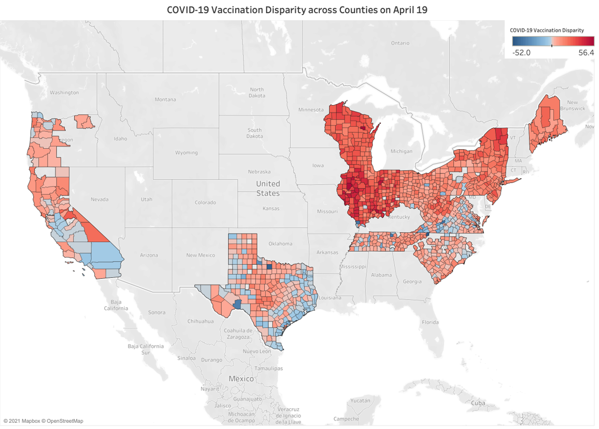
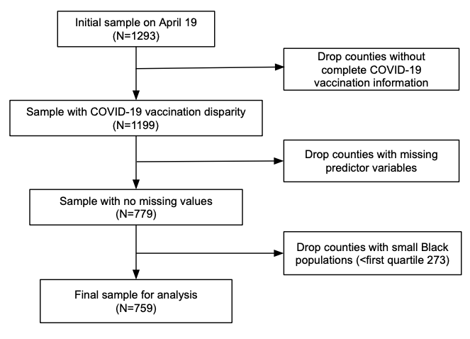

# Socioeconomic Privilege and Political Ideology are Associated with Racial Disparity in COVID-19 Vaccination: Methods and Materials

This public repository contains the materials for reproducing the results described in Agarwal et al. (2021) _Socioeconomic Privilege and Political Ideology Are Associated with Racial Disparity in COVID-19 Vaccination_ and additional supplementary analyses. 

Materials for reproducibility include:

1. [COVID-19 vaccination rate data](https://github.com/CHIDS-UMD/Covid19-Vaccination-Race-Disparity/tree/main/CountyVaccine) and Python code to reproduce the data collection, including: 

    a) The notebook [1.CountyVaccine_Automation](https://github.com/CHIDS-UMD/Covid19-Vaccination-Race-Disparity/blob/main/1.CountyVaccine_Automation.ipynb) includes the code to collect the county-level vaccination information by race from the States whose vaccination data is oragnized in a downlable table. In this notebook, the Python code can automatically scrape the data. The States include： Illinois, Texas, Pennsylvania, Indiana, and Virginia.  
    
    b) The notebook [1.CountyVaccine_Tableau](https://github.com/CHIDS-UMD/Covid19-Vaccination-Race-Disparity/blob/main/1.CountyVaccine_Tableau.ipynb) is designed to collect the county-level vaccination information by race from the States whose vaccination information is present in a Tableau Dashboard format. In this notebook, the Python code can also automatically scrape the data. The States include：New York, Wisconsin, Ohio, South Carolina, and Oregon. 
    
    c) The notebook [1.CountyVaccine_Manual](https://github.com/CHIDS-UMD/Covid19-Vaccination-Race-Disparity/blob/main/1.CountyVaccine_Manual.ipynb) is developed to collect the county-level racial vaccination information from the States whose vaccination information needs to be collected manually before running the code. These States include: California, Tennessee, North Carolina, West Virginia, Maine, and New Jersey. The instructions on manual collections are documented [here](https://github.com/CHIDS-UMD/Covid19-Vaccination-Race-Disparity/tree/main/CountyVaccine/Documents/Part1).  
    
2. [Data](https://github.com/CHIDS-UMD/Covid19-Vaccination-Race-Disparity/tree/main/DataMerge) and [Python code](https://github.com/CHIDS-UMD/Covid19-Vaccination-Race-Disparity/blob/main/2.DataMerge.ipynb) to merge information from the various sources cited in our Supplementary Information (SI) Appendix.

3. Python code for [cleaning the data](https://github.com/CHIDS-UMD/Covid19-Vaccination-Race-Disparity/blob/main/2.DataClean.ipynb). 

4. [Clean data](https://github.com/CHIDS-UMD/Covid19-Vaccination-Race-Disparity/tree/main/StataReg) and [code](https://github.com/CHIDS-UMD/Covid19-Vaccination-Race-Disparity/blob/main/3.StataCode.ipynb) to reproduce our main regression analyses (reported in main text) and robustness checks (reported in SI Appendix) as well as  additional supplementary analyses reported here. 

Below, we also provide additional summary statistics, exploratory data analysis, and full results for the robustness checks described in the SI appendix. 

## Sources for COVID-19 Vaccination Data by Race

| State          | # of Counties | # of Valid Counties | Data Source                                                                                                                                                       |
|----------------|---------------|---------------------|---------------------------------------------------------------------------------------------------------------------------------------------------------------|
| California     | 54            | 43                  | https://covid19.ca.gov/vaccines/#California-vaccines-dashboard                                                                                                |
| Illinois       | 102           | 42                  | https://www.dph.illinois.gov/covid19/vaccinedata?county=Illinois                                                                                              |
| Indiana        | 89            | 37                  | https://www.coronavirus.in.gov/vaccine/2680.htm                                                                                                               |
| Maine          | 16            | 8                   | https://www.maine.gov/covid19/vaccines/dashboard                                                                                                              |
| New Jersey     | 21            | 21                  | https://www.nj.gov/health/cd/topics/covid2019_dashboard.shtml                                                                                                 |
| New York       | 62            | 48                  | https://covid19vaccine.health.ny.gov/covid-19-vaccine-tracker                                                                                                 |
| North Carolina | 43            | 43                  | https://covid19.ncdhhs.gov/dashboard/data-behind-dashboards                                                                                                   |
| Ohio           | 88            | 57                  | https://coronavirus.ohio.gov/wps/portal/gov/covid-19/dashboards/covid-19-vaccine/covid-19-vaccination-dashboard                                               |
| Oregon         | 23            | 11                  | https://public.tableau.com/profile/oregon.health.authority.covid.19#!/vizhome/OregonCOVID-19VaccinationTrends/OregonCountyVaccinationTrends                   |
| Pennsylvania   | 60            | 40                  | https://www.health.pa.gov/topics/disease/coronavirus/Vaccine/Pages/Vaccine.aspx                                                                               |
| South Carolina | 46            | 43                  | https://scdhec.gov/covid19/covid-19-vaccination-dashboard                                                                                                     |
| Tennessee      | 90            | 62                  | https://www.tn.gov/health/cedep/ncov/data/downloadable-datasets.html                                                                                          |
| Texas          | 245           | 139                 | https://tabexternal.dshs.texas.gov/t/THD/views/COVID-19VaccineinTexasDashboard/Summary?%3Aorigin=card_share_link&%3Aembed=y&%3AisGuestRedirectFromVizportal=y |
| Virginia       | 133           | 111                 | https://www.vdh.virginia.gov/coronavirus/covid-19-vaccine-demographics/                                                                                       |
| West Virginia  | 55            | 23                  | https://dhhr.wv.gov/COVID-19/Pages/default.aspx                                                                                                               |
| Wisconsin      | 72            | 28                  | https://www.dhs.wisconsin.gov/covid-19/vaccine-data.htm#day                                                                                                   |
| Sum            | 1199          | 759                 |                                                                                                                                                               |

_Note_. Valid counties are those that were included in our main regression analyses, following the exclusion criteria outlined below in the sample construction figure. 

**Figure S1.** Map represents COVID-19 vaccination disparities across 1,199 counties with data by race as of April 19, 2021. Red indicates higher vaccination rates among Whites, and blue indicates higher vaccination rates among Blacks. The vaccination rate in some counties with small numbers of Blacks or Whites exceeded 100%. We exclude those counties in Figure 1. In the regression using data from 759 counties, the range of vaccination disparity is between -18.2% and 48.6%. 

## Missingness

**Figure S2.** Patterns of missingness in predictor and outcome variables where white lines indicate values are missing.

## Sample Construction

The filtering of the data collected for all counties on April 19, 2021.

**Figure S3.** Flowchart depicting sample construction.

## Summary Statistics

We present descriptive statistics of the variables in our regression analysis in non-standardized units. The table below presents rate and proportion data as percentages for ease of interpretation.  	

| Variable                                 | Description                                                                                            | Source                                                                                                                                                                                                                                            | Data Field             | count | mean   | std    | min     | 0.250  | 0.500  | 0.750  | max     |
|------------------------------------------|--------------------------------------------------------------------------------------------------------|---------------------------------------------------------------------------------------------------------------------------------------------------------------------------------------------------------------------------------------------------|------------------------|-------|--------|--------|---------|--------|--------|--------|---------|
| CVD                                      | Covid vaccination disparity between White and Black populations in county i.                           | Department of Health in each state                                                                                                                                                                                                                | Vax_DisparityY         | 756   | 12.119 | 10.355 | -18.168 | 4.922  | 10.451 | 17.757 | 53.842  |
| FVD                                      | Flu vaccination disparity between White and Black populations in county i.                             | CMS Mapping Medical Disparity Tool (https://data.cms.gov/mapping-medicare-disparities)                                                                                                                                                            | FluVax_DisparityY      | 756   | 15.185 | 6.445  | -12.000 | 12.000 | 16.000 | 19.000 | 37.000  |
| Median Income                            | Household median income (in thousands) in county i.                                                    | 2019 ACS 5-Year Estimates Subject Tables                                                                                                                                                                                                          | MedianIncome           | 756   | 58.448 | 16.597 | 27.063  | 48.006 | 54.517 | 64.081 | 142.299 |
| Median Income Disparity                  | Household median income disparity (in thousands) between White and Black populations in county i.      | 2019 ACS 5-Year Estimates Subject Tables                                                                                                                                                                                                          | MedianIncome_Disparity | 756   | 21.003 | 16.109 | -67.705 | 13.660 | 21.828 | 29.514 | 112.332 |
| High School Graduation Rate              | Rate of high school or above education attainment in county i.                                         | 2019 ACS 5-Year Estimates Subject Tables                                                                                                                                                                                                          | HighSchool_Rate        | 756   | 86.931 | 5.305  | 61.800  | 83.975 | 87.900 | 90.900 | 96.800  |
| High School Disparity                    | High school or above education attainment disparity between White and Black populations in county i.   | 2019 ACS 5-Year Estimates Subject Tables                                                                                                                                                                                                          | HighSchool_Disparity   | 756   | 6.762  | 7.881  | -30.300 | 2.400  | 6.200  | 10.700 | 42.200  |
| Health Facilities Per Capita             | Number of potential health facilities which provide COVID-19 vaccine per person in county i.           | VaxMap 2.0 (https://www.westhealth.org/resource/vaxmap-potential-covid-19-vaccine-locations/)                                                                                                                                                     | FacNumRate             | 756   | 0.024  | 0.012  | 0.000   | 0.017  | 0.021  | 0.026  | 0.098   |
| COVID-19 Cases Per Capita                | Number of COVID-19 cases per person in county i by April 19th, 2021                                    | The Center for Systems Science and Engineering (CSSE) at Johns Hopkins University (https://github.com/CSSEGISandData/COVID-19)                                                                                                                    | CaseRate               | 756   | 9.469  | 2.657  | 2.235   | 7.720  | 9.527  | 11.116 | 24.159  |
| Home IT Rate                             | Rate of computer ownership and internet in the home in county i.                                       | 2019 ACS 5-Year Estimates Subject Tables                                                                                                                                                                                                          | IT_Rate                | 756   | 82.684 | 7.053  | 55.600  | 78.775 | 83.400 | 87.600 | 97.000  |
| Home IT Disparity                        | Computer ownership and internet in the home disparity between White and Black populations in county i. | 2019 ACS 5-Year Estimates Subject Tables                                                                                                                                                                                                          | IT_Disparity           | 756   | 8.308  | 10.520 | -21.900 | 2.100  | 7.700  | 14.000 | 72.300  |
| Urban                                    | Dummy variable that equals 1 if county i is located in an urban area.                                  | CMS Mapping Medical Disparity Tool (https://data.cms.gov/mapping-medicare-disparities)                                                                                                                                                            | urban                  | 756   | 0.603  | 0.490  | 0.000   | 0.000  | 1.000  | 1.000  | 1.000   |
| Rate of Vehicle Ownership                | Rate of households with vehicles in county i.                                                          | CDC Social Vulnerability Index (https://www.atsdr.cdc.gov/placeandhealth/svi/index.html)                                                                                                                                                          | vehicle                | 756   | 92.914 | 4.962  | 23.000  | 91.800 | 93.700 | 95.200 | 98.600  |
| Political Ideology                       | Rate of people who voted Republican in 2020 presidential election in county i.                         | USA Today (https://www.usatoday.com/in-depth/graphics/2020/11/10/election-maps-2020-america-county-results-more-voters/6226197002/)                                                                                                               | republican_rate        | 756   | 58.749 | 16.065 | 11.249  | 48.080 | 60.414 | 71.550 | 89.324  |
| Segregation Index                        | The degree to which Black and White groups live separately from one another in county i.               | 2021 County Health Rankings (https://www.countyhealthrankings.org/explore-health-rankings/measures-data-sources/county-health-rankings-model/health-factors/social-and-economic-factors/family-social-support/residential-segregation-blackwhite) | Segregation            | 756   | 44.852 | 16.125 | 0.041   | 33.277 | 45.831 | 56.441 | 86.159  |
| Racial Bias                              | Weighted implicit racial bias in county i.                                                             | Data from Riddle and Sinclair (2019; https://osf.io/pu79a/)                                                                                                                                                                                       | racial_weighted_bias   | 756   | 39.993 | 1.879  | 31.156  | 39.199 | 40.177 | 40.888 | 44.453  |
| Vaccine Hesitancy                        | COVID-19 vaccine hesitancy in county i.                                                                | Department of Health and Human Services, Office of the Assistant Secretary for Planning and Evaluation (https://aspe.hhs.gov/pdf-report/vaccine-hesitancy)                                                                                        | hesitancy              | 756   | 17.677 | 3.798  | 7.000   | 15.000 | 18.000 | 20.000 | 27.000  |
| Proportion of Black Residents            | Proportion of black residents in county i.                                                             | County Population by Characteristics: 2010-2019 (https://www.census.gov/data/tables/time-series/demo/popest/2010s-counties-detail.html)                                                                                                           | Black_Prop             | 756   | 12.397 | 13.136 | 0.541   | 3.103  | 7.429  | 16.913 | 76.973  |
| Flu Vaccination Rate                     | Rate of flu vaccination among Medicare beneficiaries in county i.                                      | CMS Mapping Medical Disparity Tool (https://data.cms.gov/mapping-medicare-disparities)                                                                                                                                                            | FluVax_Rate            | 756   | 47.622 | 7.552  | 19.000  | 43.000 | 49.000 | 53.000 | 65.000  |
| Flu Vaccination Disparity                | Flu vaccination disparity between White and Black Medicare beneficiaries in county i.                  | CMS Mapping Medical Disparity Tool (https://data.cms.gov/mapping-medicare-disparities)                                                                                                                                                            | FluVax_Disparity       | 756   | 15.185 | 6.445  | -12.000 | 12.000 | 16.000 | 19.000 | 37.000  |
| Proportion of Pop. Above Age 75          | Rate of  Age >=75 population in county i.                                                              | County Population by Characteristics: 2010-2019 (https://www.census.gov/data/tables/time-series/demo/popest/2010s-counties-detail.html)                                                                                                           | Above75_Rate           | 756   | 7.680  | 1.844  | 3.515   | 6.469  | 7.697  | 8.758  | 17.853  |
| Above Age 75 Disparity                   | Age >= 75 population disparity between white and black people in county i.                             | County Population by Characteristics: 2010-2019 (https://www.census.gov/data/tables/time-series/demo/popest/2010s-counties-detail.html)                                                                                                           | Above75_Disparity      | 756   | 4.583  | 2.452  | -4.481  | 3.099  | 4.717  | 5.966  | 17.401  |
| Proportion of Pop. Above Age 15 Below 74 | Rate of  15 <= age <= 74 population in county i.                                                       | County Population by Characteristics: 2010-2019 (https://www.census.gov/data/tables/time-series/demo/popest/2010s-counties-detail.html)                                                                                                           | A15T74_Rate            | 756   | 74.389 | 2.144  | 65.922  | 73.190 | 74.299 | 75.436 | 83.149  |
| Age 15 <= Age <= 74 Disparity            | 15 <= age <= 74 population disparity between white and black people in county i.                       | County Population by Characteristics: 2010-2019 (https://www.census.gov/data/tables/time-series/demo/popest/2010s-counties-detail.html)                                                                                                           | A15T74_Disparity       | 756   | -0.433 | 4.311  | -20.894 | -1.974 | 0.064  | 1.996  | 17.110  |
| Test Positivity                          | Rate of Nucleic Acid Amplification Tests (NAATs) positivity in county i.                                | CDC COVID-19 Integrated County View (https://covid.cdc.gov/covid-data-tracker/#county-view)                                                                                                                                                       | Positivity             | 756   | 6.334  | 3.765  | 0.000   | 3.828  | 5.760  | 8.433  | 26.080  |

### Correlation Matrix Heatmap

**Figure S4.** A correlation matrix heatmap illustrate bivariate relationships among all variables in our main regression results and robustness checks.

## Detailed Regression Results and Robustness Checks

### Regression Results

OLS regression results for robustness checks (Models 1, 2, 5, and 6) are presented below along with results from the main text (Models 3 and 4, also in bold font) with all continuous variables standardized for ease of interpretation. **Note:** * _p_ < .05, ** _p_ < .01. 

|                                 | (1)            | (2)            |<b> (3) </b>           | <b>(4)</b>       | (5)            | (6)            |
|---------------------------------|----------------|----------------|----------------|-----------|----------------|----------------|
| VARIABLES                       | CVD (March 27, 2021) | CVD (April 07, 2021) | <b> CVD (April 19, 2021)</b> |  <b> FVD</b>       | CVD (April 19, 2021) | CVD (April 19, 2021) |
|                                 |                |                |                |           |                |                |
| **Economic Stability**            |                |                |                |           |                |                |
| Median Income                   | -1.937*       | -2.320*       |<b> -2.434* </b>     | <b>1.145</b>    | -3.217**      | -2.240*       |
|                                 | (0.866)        | (0.995)        | <b>(1.084) </b>       | <b>(0.589) </b>  | (1.054)        | (0.929)        |
| Median Income Disparity         | 0.703*        | 0.776         | <b>0.984</b>         | <b>0.843*</b>   | 0.625          | 1.109*        |
|                                 | (0.287)        | (0.394)        | <b>(0.489)</b>        | <b>(0.312)</b>   | (0.486)        | (0.497)        |
|**Education Access and Quality**                                |                |                |                |           |                |                |
| High School Graduation Rate     | 2.177**       | 2.639**       | <b>2.790**</b>       | <b>-0.243</b>    | 2.891**       | 3.024**       |
|                                 | (0.510)        | (0.637)        | <b>(0.729)</b>        | <b>(0.336)</b>   | (0.638)        | (0.481)        |
| High School Disparity           | 2.043**       | 2.562**       | <b>2.993**</b>       | <b>-0.116</b>    | 2.861**       | 1.981**       |
|                                 | (0.420)        | (0.435)        | <b>(0.474)</b>        | <b>(0.469)</b>   | (0.458)        | (0.515)        |
|**Healthcare Access and Quality**                                 |                |                |                |           |                |                |
| Health Facilities Per Capita    | 1.012         | 1.147          | <b>1.451</b>         | <b>-0.282</b>    | 1.354*        | 1.304*        |
|                                 | (0.498)        | (0.655)        | <b>(0.760)</b>        | <b>(0.350)</b>   | (0.621)        | (0.581)        |
| COVID-19 Cases Per Capita       | 0.379          | 0.488          | <b>0.318</b>         | <b>0.219</b>     | 0.496          | 0.632*        |
|                                 | (0.405)        | (0.444)        | <b>(0.488)</b>        | <b>(0.330)</b>   | (0.310)        | (0.240)        |
|**Neighborhood and Built Environment**                                 |                |                |                |           |                |                |
| Home IT Rate                    | 1.148**       | 1.266*        | <b>1.576**</b>       | <b>0.113</b>     | 1.610*        | 0.705          |
|                                 | (0.370)        | (0.441)        | <b>(0.472)</b>        | <b>(0.382)</b>   | (0.558)        | (0.584)        |
| Home IT Disparity               | -0.00401       | 0.118          | <b>0.216</b>          | <b>0.0783</b>    | 0.0242         | 0.633          |
|                                 | (0.539)        | (0.609)        | <b>(0.756)</b>        | <b>(0.380)</b>   | (0.700)        | (0.684)        |
| Urban                           | -0.591         | -0.285         |<b>0.168</b>          | <b>0.182</b>     | -0.280         | -0.445         |
|                                 | (0.482)        | (0.625)        | <b>(0.789)</b>        | <b>(0.651)</b>   | (0.730)        | (0.598)        |
|Rate of Vehicle Ownership          | 2.358*        | 2.962**       | <b>3.012*</b>        | <b>-0.119</b>    | 2.551*        | 1.443          |
|                                 | (0.836)        | (0.967)        | <b>(1.227)<b>        | <b>(0.654)</b>   | (1.101)        | (1.084)        |
|**Social and Community Context**                                 |                |                |                |           |                |                |
| Political Ideology              | -2.053**      | -2.601**      | <b>-3.095**</b>      | <b>-1.764**</b> | -2.678**      | -2.216**      |
|                                 | (0.597)        | (0.658)        | <b>(0.722)</b>        | <b>(0.410)</b>   | (0.538)        | (0.478)        |
| Segregation                     | 0.264          | 0.531          |<b>0.599</b>          | <b>0.813**</b>  | 0.370          | 0.521          |
|                                 | (0.511)        | (0.594)        | <b>(0.715)</b>        | <b>(0.257)</b>   | (0.682)        | (0.751)        |
| Racial Bias                     | 1.169*        | 1.145         | <b>1.144</b>          | <b>0.331</b>     | 0.980         | 0.429          |
|                                 | (0.509)        | (0.606)        | <b>(0.705)</b>        | <b>(0.390)</b>   | (0.524)        | (0.401)        |
|**Covariates**                                 |                |                |                |           |                |                |
| Vaccine Hesitancy               | 1.231          | 1.290          | <b>1.335</b>          | <b>-0.388</b>    | 1.754          | 0.790          |
|                                 | (1.380)        | (1.630)        | <b>(1.776)</b>        | <b>(0.679)</b>   | (1.599)        | (1.358)        |
| Proportion of Black Pop.        | -1.672         | -1.798         | <b>-2.072</b>         | <b>0.0393</b>    | -1.820         | -1.338         |
|                                 | (1.043)        | (1.226)        | <b>(1.290)</b>        | <b>(0.551)</b>   | (1.092)        | (0.909)        |
| Flu Vaccination Rate            |                |                |                |           | 1.686*        | 0.839          |
|                                 |                |                |                |           | (0.621)        | (0.513)        |
| Flu Vaccination Disparity       |                |                |                |           | 1.351**       | 0.944         |
|                                 |                |                |                |           | (0.443)        | (0.485)        |
| Proportion of Pop. Above Age 75 |                |                |                |           |                | -1.751*       |
|                                 |                |                |                |           |                | (0.674)        |
| Above Age 75 Disparity          |                |                |                |           |                | 3.281**       |
|                                 |                |                |                |           |                | (0.493)        |
| Constant                        | 7.764**       | 7.475**       | <b>8.025**</b>       | <b>12.95**</b>  | 9.218**       | 9.849**       |
|                                 | (1.685)        | (1.022)        | <b>(1.125)</b>        | <b>(0.803)</b>   | (0.957)        | (0.912)        |
|                                 |                |                |                |           |                |                |
| Observations                    | 759            | 759            | <b>759</b>            | <b>759</b>       | 759            | 759            |
| Covered Population (million)    | 171.99         | 171.99         | <b>171.99</b>         | <b>171.99</b>    | 171.99         | 171.99         |
| Covered Population (proportion) | 0.524          | 0.524          | <b>0.524</b>          | <b>0.524</b>     | 0.524          | 0.524          |
| R-squared                       | 0.813          | 0.818          |<b>0.823</b>          | <b>0.453 </b>    | 0.839          | 0.863          |
| State Dummies                   | True           | True           | <b>True</b>           | <b>True</b>      | True           | True           |
| Robust Standard Error           | True           | True           | <b>True</b>           | <b>True</b>      | True           | True           |
| Clustered at State Level        | True           | True           | <b>True</b>           | <b>True</b>      | True           | True           |
| Weighted with County Population | True           | True           | <b>True</b>           | <b>True</b>      | True           | True           |
